# Do It Platform — Provider Onboarding & Verification System (Mermaid Version)

**Scope:** Complete implementable plan for provider signup → KYC → category/skill selection → physical/digital/errand verification → dashboard access. Extends the existing Do It architecture (`provider_profiles`, `kyc_documents` collections; JWT auth; S3/R2 signed URLs; Bull workers) rather than replacing it.

**Note on diagrams:** This version uses Mermaid syntax — renders as real diagrams in GitHub, GitLab, Obsidian, Typora, Notion, VS Code (with the Mermaid preview extension), or mermaid.live. For a version that renders as ASCII art anywhere with zero setup, use the companion file `DO_IT_PROVIDER_ONBOARDING_VERIFICATION.md`.

---

## 1. Flow Overview

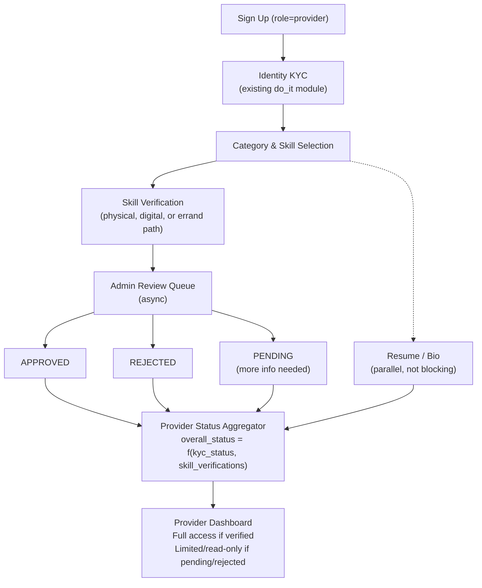

**Key principle:** identity KYC (who you are) and skill verification (what you can do, and to what trust level) are **separate pipelines that run in parallel**, not one blocking sequence. A provider can browse the app, complete their profile, and see "pending" states while both pipelines resolve — but cannot submit proposals or accept jobs in a given category until that category's skill is verified AND identity KYC is approved.

---

## 2. Screen-by-Screen Storyboard

### 2.1 Provider-Facing Screen Flow

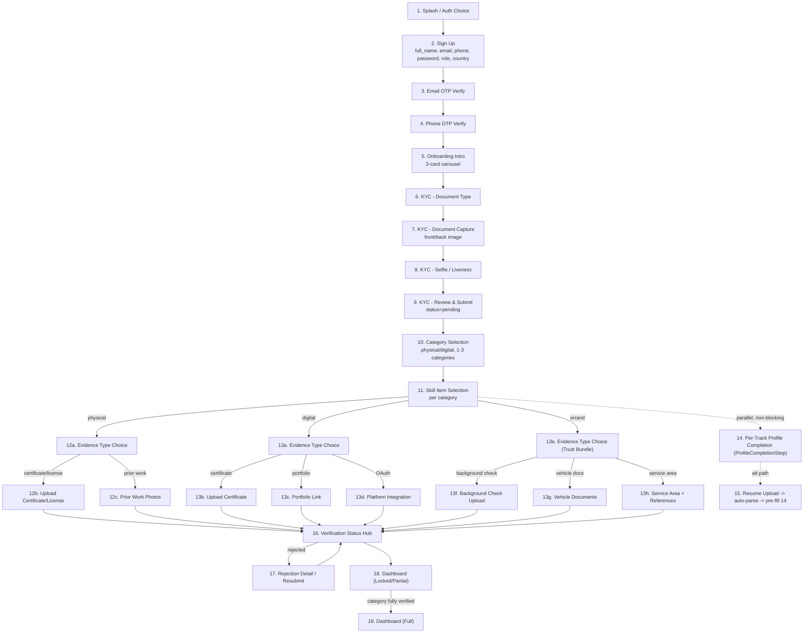

### 2.2 Field & Validation Reference Table

| # | Screen | Key Fields | Validation Rules | Decision Branches |
|---|---|---|---|---|
| 2 | Sign Up | full_name, email, phone, password, role, country | email unique/format; phone E.164; password ≥8 chars +1 digit +1 symbol; ToS required | role=provider → onboarding wizard; role=client → client home |
| 3–4 | OTP Verify (email/phone) | 6-digit OTP | numeric, expires 10 min, max 5 attempts | success → next step; 5 fails → 60s cooldown |
| 6–9 | KYC (type/capture/selfie/review) | id_type, front/back image, live selfie | image ≥600x400px, ≤10MB, blur/glare check; liveness prompts | submit → status=pending, non-blocking continue to Category Selection |
| 10 | Category Selection | job_type, 1–3 categories | ≥1 category required | physical → physical path; digital → digital path; both allowed |
| 11 | Skill Item Selection | multi-select skill_items per category | ≥1 skill_item per category | continue → per-category verification |
| 12a–12c | Physical evidence | evidence_type + type-specific fields (see §4) | ≥1 evidence type per physical category | certificate/license/photos → upload |
| 13a–13d | Digital evidence | evidence_type + type-specific fields (see §5) | ≥1 evidence type per digital category | certificate w/ URL → auto-verify attempt; else → manual review |
| 13e–13h | Errand evidence (Trust Bundle) | evidence_type + background check + vehicle docs (if required) + service area + references (see §6) | background check required; vehicle docs required if any selected skill requires a vehicle | one bundle record per category → manual admin review |
| 14 | Per-Track Profile Completion | universal (photo, headline, bio ≤500 chars, city, languages, availability, visibility) + per-track: physical (years_experience, service_radius_km, tools_equipment, hourly_rate, team_size, insurance, transport), digital (skills, tech_stack, hourly_rate/project_rate, timezone, english_proficiency, work_history[], education[], resume), errand (transport_mode, base_fee, per_km_fee, working_hours, max_payload_kg, same_day_express, goods_insurance; service_area read-only from verified bundle) | non-blocking, anytime; errand transport must be motorized when any selected skill requires a vehicle | save → completeness meter update (required ~60% + optional ~40%) |
| 15 | Resume Upload | file (PDF/DOC ≤5MB) | file type/size check | parsed → pre-fills Screen 14, user confirms |
| 16 | Verification Status Hub | status badges per category/skill | — | tap → detail w/ SLA + resubmit option |
| 17 | Rejection Detail | rejection_reason, resubmit CTA | must address reason before resubmit enabled | resubmit → new VerificationRecord, status resets |
| 18–19 | Dashboard (Locked/Full) | banner: "X of Y verifications complete" | — | ≥1 category verified → unlock browse/apply for that category |

### 2.3 Admin-Facing Screens

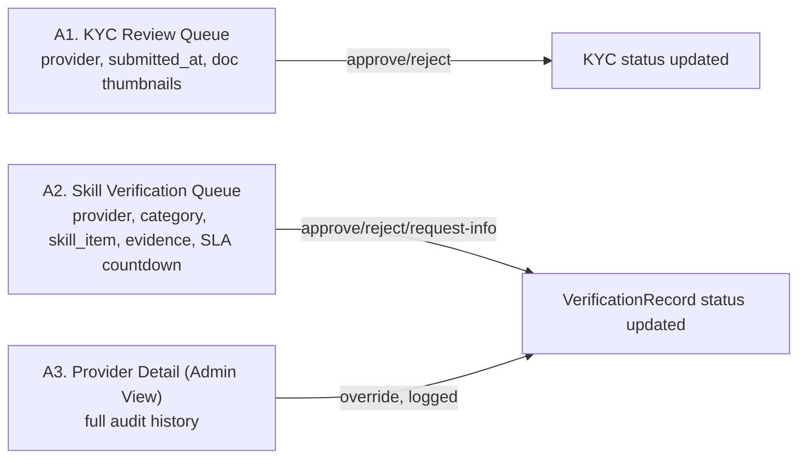

---

## 3. Data Model Sketches

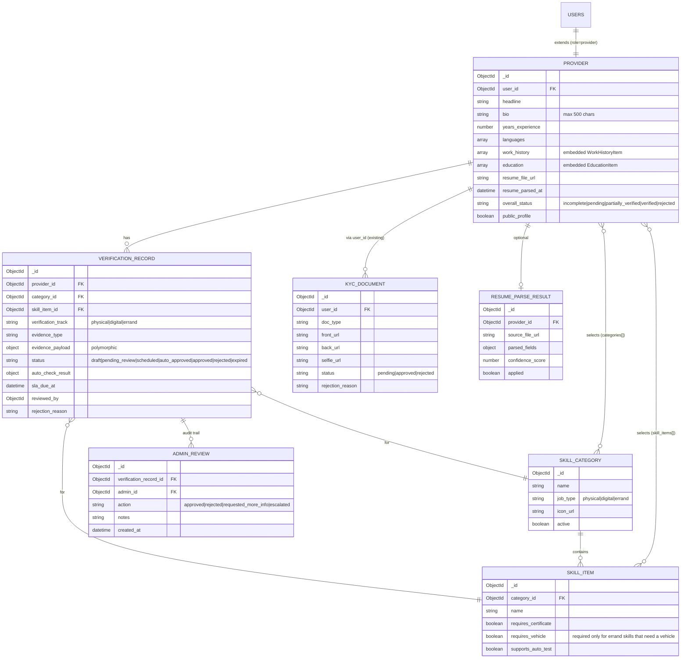

**Status enums (canonical):**
```
KYCDocument.status:          pending | approved | rejected
VerificationRecord.status:   draft | pending_review | scheduled |
                              auto_approved | approved | rejected | expired
Provider.overall_status:     incomplete | pending | partially_verified |
                              verified | rejected
```

`Provider.overall_status` is a **derived/aggregated field**, recomputed on every KYCDocument or VerificationRecord status change:

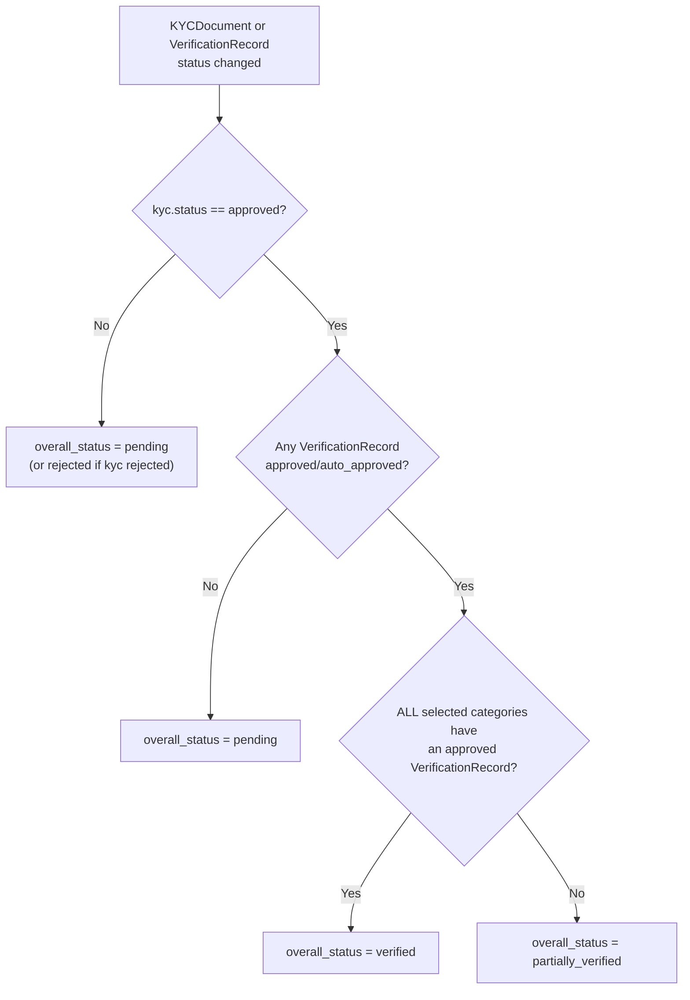

---

## 4. Physical Skills Verification

**Data collected:** issuing institution/licensing body, credential ID, issue/expiry date, category + skill_item(s) covered, self-reported years of experience, service radius/regions (for regulated trades).

**Evidence submission methods:**
1. Certificate/license photo or PDF upload
2. Prior work photos (3–10, captioned, optional client reference)
3. Video demo (Phase 2)

**Verification workflow:**

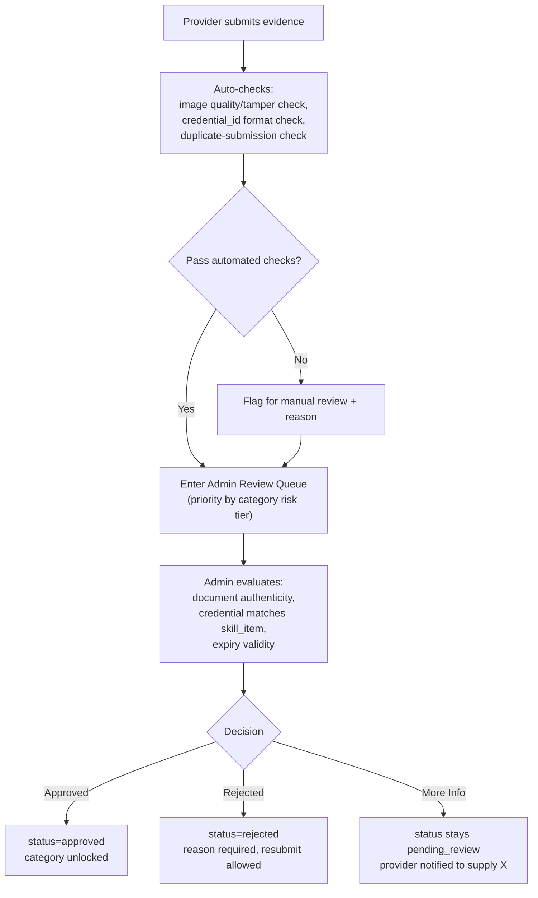

**Criteria examples by risk tier:**

| Risk tier | Examples | Minimum evidence required |
|---|---|---|
| Low | Cleaning, moving help | 1 of: prior work photos OR self-attestation + rating history |
| Medium | Home repair, tutoring in-person | Certificate/license OR ≥3 prior work photos + reference |
| High (regulated) | Electrical, plumbing (legally licensed trades) | Valid license/certificate mandatory |

**SLA:** target 48 hours for document-based review (configurable per category).

---

## 5. Digital Skills Verification

**Evidence types:** certificates (with optional `credential_url`), portfolio links, OAuth platform integrations (GitHub, Upwork, LinkedIn), skill endorsements (Phase 2).

**Automated checks:** domain/URL reachability, credential-URL auto-verify against issuer's public verify page, OAuth token validity as ownership proof, duplicate/fraud heuristics on portfolio URLs.

**Automation decision logic:**

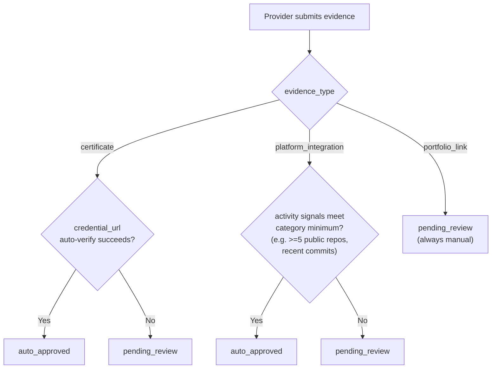

**Verification workflow:**

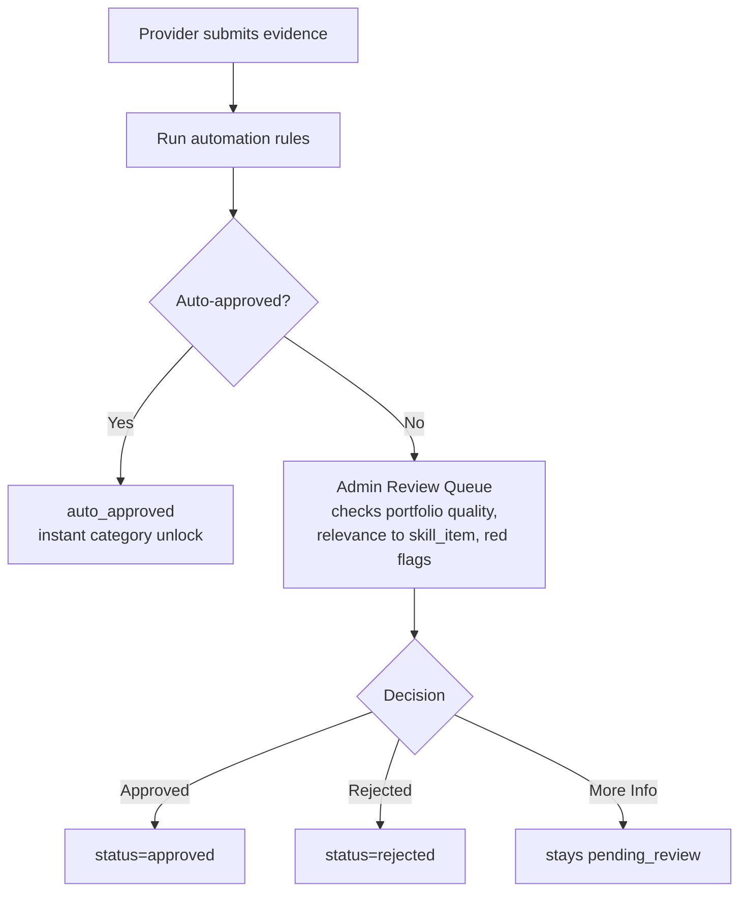

**SLA:** auto-approved paths are instant; manual review target 24–48 hours.

---

## 6. Errands & Delivery Verification (Trust Track)

**What it is:** a third work type alongside physical (trades) and digital (knowledge work). Errands & Delivery covers on-demand physical tasks and pick-up/drop services — parcel & document delivery, personal errands, grocery/shopping delivery, and light move-and-carry. Example jobs a client can post:
- "Take my parcel from the post office and drop it at my home."
- "Pick up this document from my home and leave it at the bus stand so I can collect it there."
- "Buy these groceries for me and deliver them."

**Proposed errand categories & skills:**

| Category | Sample skills |
|---|---|
| Parcel & Document Delivery | Document Courier, Parcel Delivery, Same-City Drop-off, Cross-City Pickup & Drop |
| Personal Errands | Errand Runner, Station/Bus-Stand Pickup & Drop, Shopping Assistant, Government Office Errands |
| Grocery & Shopping Delivery | Grocery Shopping & Delivery, Pharmacy/Medicine Pickup, Shop & Deliver |
| Move & Carry (light) | Furniture Carry, Market Shopping Carry, Bulk Parcel Moving |

Each errand skill can set `requires_vehicle` (bike/scooter/car), which makes vehicle documents a required evidence item — analogous to `requires_certificate` for physical.

**Market context (2026 research):** the global errand-service market was roughly $19–21B in 2023–24 and is projected to reach ~$44–45B by 2032–33 (~9–10% CAGR; another source sizes it at ~$25B in 2026 → ~$59B by 2035). Leading players include TaskRabbit, Airtasker, Thumbtack, Urban Company, Dunzo, Swiggy Genie, Porter, Borzo, and Lalamove. Caution from the market: standalone one-off-errand apps (Swiggy Genie, Dunzo) struggled on thin margins and unpredictable supply — but Do It does not operate logistics; it is a job marketplace with a trust/verification layer, so Errands & Delivery rides the existing post-job → match → escrow engine. The industry-standard verification for courier/errand workers is identity + criminal/background checks + driving-record and vehicle-document checks, layered as instant checks then deeper checks, with periodic re-screening.

**Key principle:** unlike physical (skill/certification) and digital (portfolio/skill proof), errand verification proves **trust, reliability, and reach**. Identity is already covered by KYC; the new layer is a **Trust Bundle** — one record per errand category, mirroring the physical/digital bundle.

**Data collected:** background/character-check certificate or police clearance (required), vehicle documents (required only if a selected skill needs a vehicle), references / prior task history (optional), service area/radius, years of errand experience (optional).

**Evidence submission methods (Trust Bundle):**
1. Background / character check (criminal-record or police-clearance document) — required
2. Vehicle documents — driving licence, vehicle registration, insurance (shown only when a skill requires a vehicle)
3. References / prior task history — optional, 1–2 contacts or delivery screenshots
4. Service area / radius — city or area of operation

**Verification workflow:**

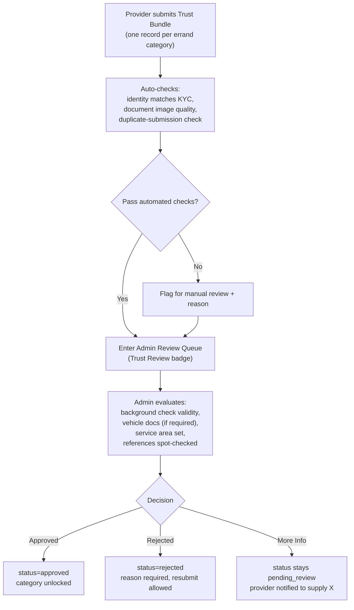

**Requirements by risk tier:**

| Risk tier | Examples | Minimum evidence required |
|---|---|---|
| Low | Grocery/shopping delivery, light errands | Background check required |
| Medium | Parcel & document delivery (non-confidential) | Background check + service area; vehicle docs if vehicle-based |
| High (trust-sensitive) | Confidential/high-value documents, medicine pickup | Background check + references; vehicle docs if vehicle-based; optional enhanced check |

**Regulatory note:** passenger rides ("take me to the bus station") are excluded from MVP — ridesharing requires commercial driver licensing, permits, and insurance in most jurisdictions. The platform supports document/parcel errands ("drop my document at the bus stand"), which are not subject to those rules. Passenger rides can be revisited as a separate regulated feature.

**SLA:** target 24–48 hours for background/document review (configurable per category).

**Ongoing trust (Phase 2):** after approval, trust is maintained through job ratings, on-time completion, and time/location-stamped proof-of-delivery photos; a third-party background-check API and periodic re-screening run as a Bull worker.

---

## 7. Resume / Bio Capture

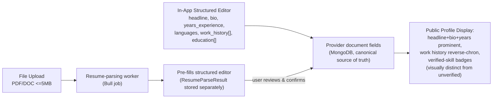

**Storage notes:**
- Structured fields → `Provider` document fields directly.
- Raw uploaded resume file → S3/R2, signed URL in `Provider.resume_file_url`; original retained for re-parsing/audit, not directly public.
- `ResumeParseResult` keeps raw parser output + confidence score separately — parsing never auto-publishes without a user confirm step.
- `public_profile` toggle lets a provider opt out of public visibility while remaining matchable for jobs.

---

## 8. UI/UX Considerations

- **Accessibility:** labeled inputs (not placeholder-only), screen-reader status announcements, ≥44px touch targets, color paired with icon+text for status badges, dynamic font scaling, text instructions alongside camera screens.
- **Progressive disclosure:** one decision at a time in the wizard (category → skill_items → evidence type → upload form); optional fields (credential_id, expiry_date) collapsed by default; resume upload offers parsing but never hides the manual editor.
- **Validation feedback:** inline real-time validation on blur, server errors mapped to specific fields, upload progress + specific failure reasons (not generic errors).
- **Mobile responsiveness:** camera-first capture screens with gallery fallback only where liveness/tamper-resistance isn't required (never for KYC selfie); long forms use list-based add/remove item patterns, consistent with existing Do It mobile conventions.
- **Role-based views:** provider app never surfaces internal admin fields (reviewer identity, risk-tier scoring) — only status + reason + next action. Admin portal (web, aligned with the deferred Phase 11 website/admin build) gets review queues, SLA countdowns, bulk actions, audit trail, logged overrides. Until then, MVP admin review runs through protected `/api/v1/admin/*` endpoints via a lightweight internal tool.

---

## 9. Tech Stack, API Endpoints & Phased Rollout

**Stack (consistent with existing Do It architecture — no new core technology introduced):**

| Concern | Technology |
|---|---|
| Mobile UI | React Native (Expo), TypeScript, existing theme system |
| Backend | Node.js + Express, new `verification` module alongside existing `kyc` module |
| Database | MongoDB Atlas — new `verification_records`, `admin_reviews`, `resume_parse_results` collections |
| File storage | S3/Cloudflare R2, signed URLs (reuse existing KYC document pipeline pattern) |
| Async processing | Bull/Redis — new queues: `verification-auto-check`, `resume-parse`, `credential-url-verify` |
| OAuth integrations | GitHub OAuth (Phase 2), Upwork/LinkedIn (Phase 2, if APIs permit) |
| Resume parsing | Third-party parsing API (e.g. Affinda, Sovren) called from a Bull worker — vendor spike in Phase 2 |
| Background checks | Manual document upload in MVP; third-party screening API + periodic re-screening (Phase 2, Bull worker) |

| Notifications | Existing FCM/SendGrid/Twilio pipeline — new event types for verification status changes |

**API endpoints (new, under `/api/v1`):**
```
POST   /providers/categories                          select categories + skill_items
GET    /providers/categories                           list current selections

POST   /providers/verification-records                  submit new evidence (any track/type)
GET    /providers/verification-records                   list own records + statuses
GET    /providers/verification-records/:id                detail + status + reason
POST   /providers/verification-records/:id/resubmit       resubmit after rejection

POST   /providers/resume/upload                          upload resume file -> triggers parse job
GET    /providers/resume/parse-result/:id                  fetch parsed fields for review
PATCH  /providers/profile                                 update bio/headline/work_history/education

POST   /providers/oauth/github/connect                     initiate OAuth
GET    /providers/oauth/github/callback                      handle callback, pull signals

--- Admin (role + IP-whitelist + MFA hardened, per existing security model) ---
GET    /admin/verification-records?status=pending_review&category=&sla_overdue=
POST   /admin/verification-records/:id/approve
POST   /admin/verification-records/:id/reject           { reason }
POST   /admin/verification-records/:id/request-info      { message }
GET    /admin/verification-records/:id/audit-trail
```

**Example end-to-end data flow (digital, certificate with auto-verify):**

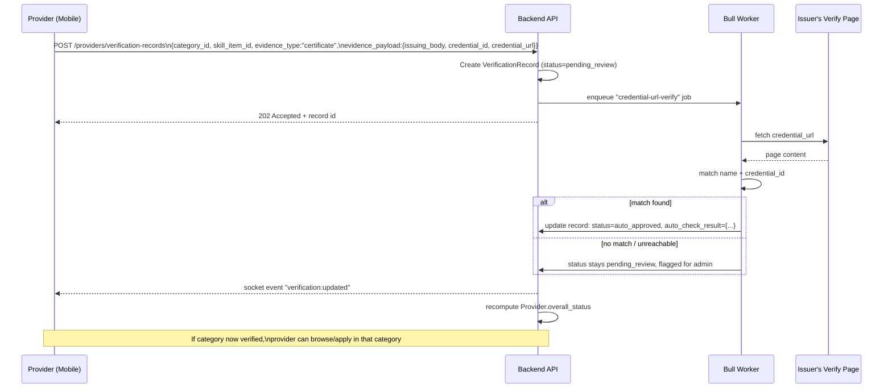

**Phased rollout:**

### MVP (Phase A — ships alongside/after existing Phase 2 "KYC & Provider Activation" in the master roadmap)
- Signup → identity KYC (existing pipeline, unchanged)
- Category + skill_item selection (up to 3 categories)
- Physical track: certificate/license + prior-work-photo upload only (manual admin review)
- Digital track: certificate + portfolio link only (manual admin review, no auto-verify/OAuth yet)
- Errands & Delivery track: Trust Bundle (background/character check + vehicle docs + service area + references), one record per category, manual admin review
- Structured bio/resume editor (manual entry or plain file upload, no auto-fill yet)
- Admin review via lightweight internal tool consuming `/admin/verification-records`
- Provider dashboard with locked/partial/full states
- Basic status notifications (in-app + push)

### Phase 2 (post-MVP enhancement)
- Automated credential-URL verification
- OAuth platform integrations (GitHub first)
- Resume file upload with automated parsing + pre-fill/confirm flow
- Third-party background-check API + periodic re-screening for errand providers (Bull worker)
- Ongoing trust signals for errands: job ratings, on-time completion, time/location-stamped proof-of-delivery photos
- Skill endorsements from completed jobs
- Richer public profile (portfolio gallery, endorsement counts, verified-badge tiers)
- Dedicated admin web portal (aligns with master roadmap's deferred Phase 11), replacing the MVP's lightweight internal tool

---

## 10. Summary Table — Deliverables Checklist

| Deliverable | Where covered |
|---|---|
| Flow overview diagram | §1 |
| Screen-by-screen storyboard (provider) | §2.1, §2.2 |
| Screen-by-screen storyboard (admin) | §2.3 |
| Data models (Provider, VerificationRecord, AdminReview, etc.) | §3 |
| Physical verification: data, evidence, workflow | §4 |
| Digital verification: evidence, automation, workflow | §5 |
| Errands & Delivery verification: evidence, workflow | §6 |
| Resume/Bio capture and storage | §7 — replaced by per-track profile completion (`docs/PROFILE_COMPLETION_PER_TRACK.md`) |
| UI/UX: accessibility, progressive disclosure, validation, responsiveness, role-based views | §8 |
| Tech stack | §9 |
| API endpoints | §9 |
| Status enums | §3 |
| Example data flow | §9 |
| Phased rollout (MVP vs Phase 2) | §9 |
