# Do It Platform - Complete System Architecture & Flow Reference

Purpose: this is the single condensed handoff document for a new LLM.
It explains what the app is, how the major flows work, where the source of truth lives, and how the backend and mobile app interact.

If another document conflicts with this one, use the more recent implementation status in [IMPLEMENTATION_STATUS.md](IMPLEMENTATION_STATUS.md).

Last updated: 2026-07-24

Sources consolidated:

- [DO_IT_MASTER_DOCUMENTATION.md](DO_IT_MASTER_DOCUMENTATION.md)
- [IMPLEMENTATION_PHASES.md](IMPLEMENTATION_PHASES.md)
- [detail_for_frontend.md](detail_for_frontend.md)
- [HANDOFF_PROMPT.md](HANDOFF_PROMPT.md)
- [IMPLEMENTATION_STATUS.md](IMPLEMENTATION_STATUS.md)

## 0. One-Paragraph Summary

Do It is a React Native (Expo/TypeScript) global service marketplace connecting Clients, who post jobs and pay via wallet, and Providers, who apply, complete work, and get paid, for both physical/local jobs and digital/remote jobs. The backend is a Node.js + Express modular monolith on MongoDB Atlas with Redis/Bull for queues, Socket.io for realtime, Stripe for top-ups, Wise for payouts, and a ledger-first wallet/escrow system. The current build order is mobile app + backend first, with website and admin portal deferred to the final stage, but the backend must stay forward-compatible for that later web layer.

## 1. High-Level Architecture

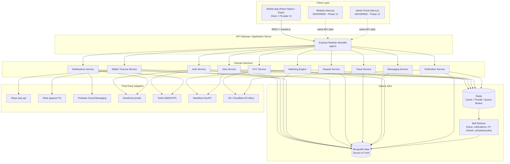

Key architectural rules:

- Modular monolith first, one deployable backend, clear module boundaries.
- Event-driven side effects. For example, `proposal:accepted` emits an event that triggers wallet escrow lock, notifications, and analytics updates as reactions, not as inline chained calls.
- Queue-backed async work for anything non-critical or slow, such as fraud scoring, notification fanout, FX refresh, and reconciliation.
- No frontend-specific logic in the persistence layer. Response shaping for mobile and future web happens in dedicated mappers.
- API versioning through `/api/v1` and a shared domain service layer lets the mobile app ship now and the website/admin plug into the same backend later without breaking changes.

## 2. Confirmed Tech Stack

| Layer | Technology |
|---|---|
| Mobile app | React Native (Expo SDK 51+), TypeScript only |
| Router | Expo Router (file-based, `app/` folder) |
| Mobile state | Zustand (global) + `useState` (local) |
| Mobile HTTP | Axios (`src/services/api.ts`) |
| Realtime client | Socket.io client |
| Mobile storage | `expo-secure-store` (tokens), MMKV (cache) |
| Maps/location | `expo-location`, `react-native-maps` |
| Backend API | Node.js + Express.js |
| Database | MongoDB Atlas |
| Cache / Queues | Redis + Bull |
| Realtime server | Socket.io |
| File storage | AWS S3 or Cloudflare R2 |
| Push notifications | Firebase Cloud Messaging (FCM) |
| Payments (in) | Stripe (wallet top-up) |
| Payments (out) | Wise (payout / FX conversion) |
| Email | SendGrid |
| SMS / OTP | Twilio |
| Geolocation | MaxMind GeoIP2 |
| Future website/admin | Next.js, separate codebase, same backend |

## 3. Roles and Access Model

- Client: posts jobs, accepts proposals, funds escrow, confirms completion, leaves reviews.
- Provider: completes KYC, browses/applies to jobs, completes work, receives payouts.
- Admin: KYC review, dispute resolution, fraud review, moderation and ops. Admin endpoints get extra hardening: role check, IP whitelist, and MFA.

Auth mechanics are JWT access tokens with short TTL, refresh token rotation with revocation tracking, role-based authorization middleware, and device/session tracking for suspicious activity.

## 4. Core Business Flows

### 4.1 Onboarding and Verification

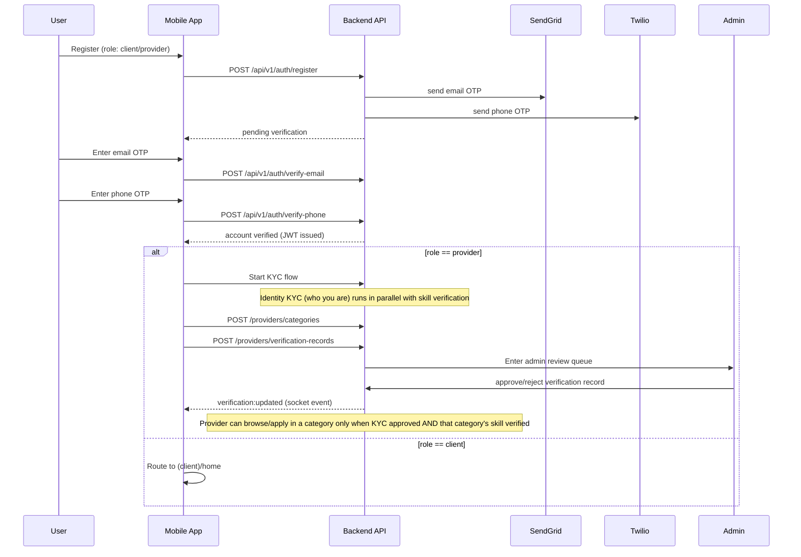

Implementation notes:

- The backend generates OTPs and stores them with expiry and attempt counters.
- When debug mode is enabled, OTP delivery can be bypassed for development.
- The mobile app can surface debug OTP values when configured for local development.
- Identity KYC (who you are) and skill verification (what you can do) are separate pipelines that run in parallel — KYC does not block skill evidence submission.
- Provider.overall_status is a derived field (incomplete/pending/partially_verified/verified/rejected) recomputed on every KYC or verification record status change.

### 4.2 Job Lifecycle

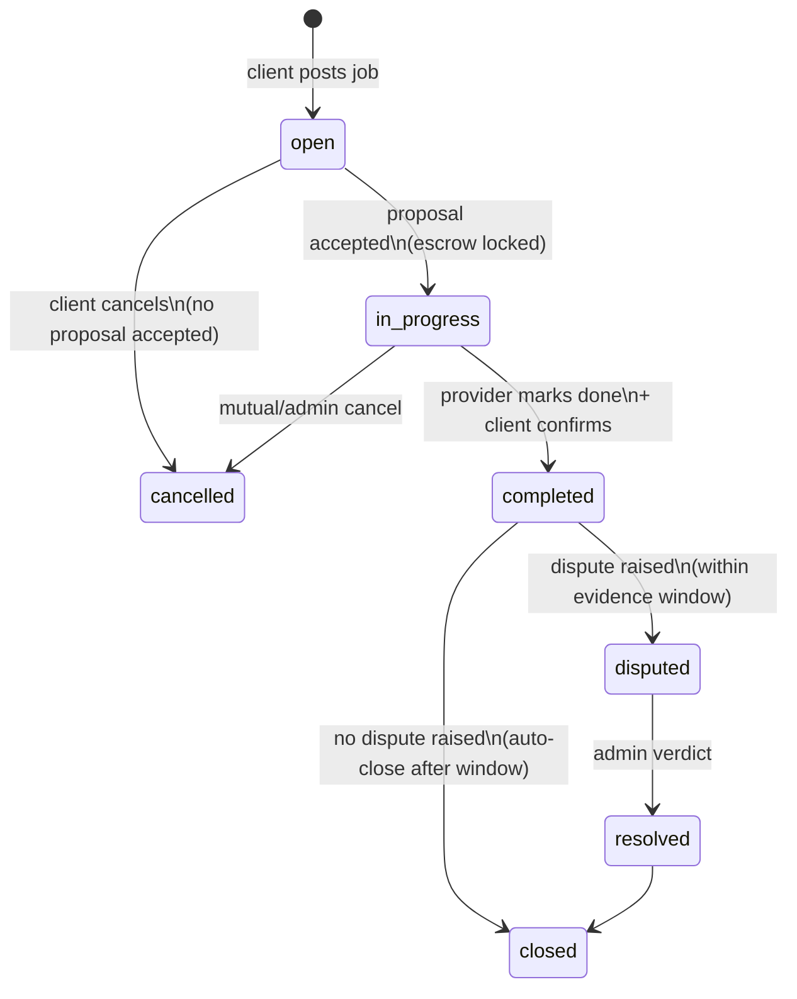

Hard rules:

- Exactly one accepted proposal per job.
- Escrow lock is required at the `open -> in_progress` transition.
- Payout only fires after client confirmation or a dispute verdict.
- Dispute outcomes are immutable once finalized, except via an admin correction flow that writes an audit log entry.

### 4.3 Matching Algorithm

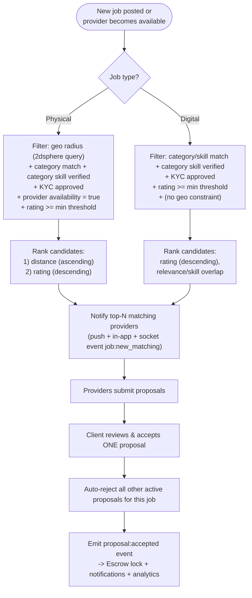

Ranking pseudocode:

```text
function rankProviders(job, candidates):
    if job.type == "physical":
        candidates = filter(candidates, c =>
            c.overall_status == "verified" and
            c.kyc_status == "approved" and
            c.categories includes job.category_id and
            c.category_verified[job.category_id] == true and
            c.available == true and
            geoDistance(c.location, job.location) <= c.service_radius and
            c.rating >= MIN_RATING)
        return sortBy(candidates, [distanceAsc, ratingDesc])

    if job.type == "digital":
        candidates = filter(candidates, c =>
            c.overall_status == "verified" and
            c.kyc_status == "approved" and
            c.categories includes job.category_id and
            c.category_verified[job.category_id] == true and
            c.rating >= MIN_RATING)
        return sortBy(candidates, [ratingDesc, skillOverlapDesc])
```

### 4.4 Wallet, Escrow, and Payment Flow

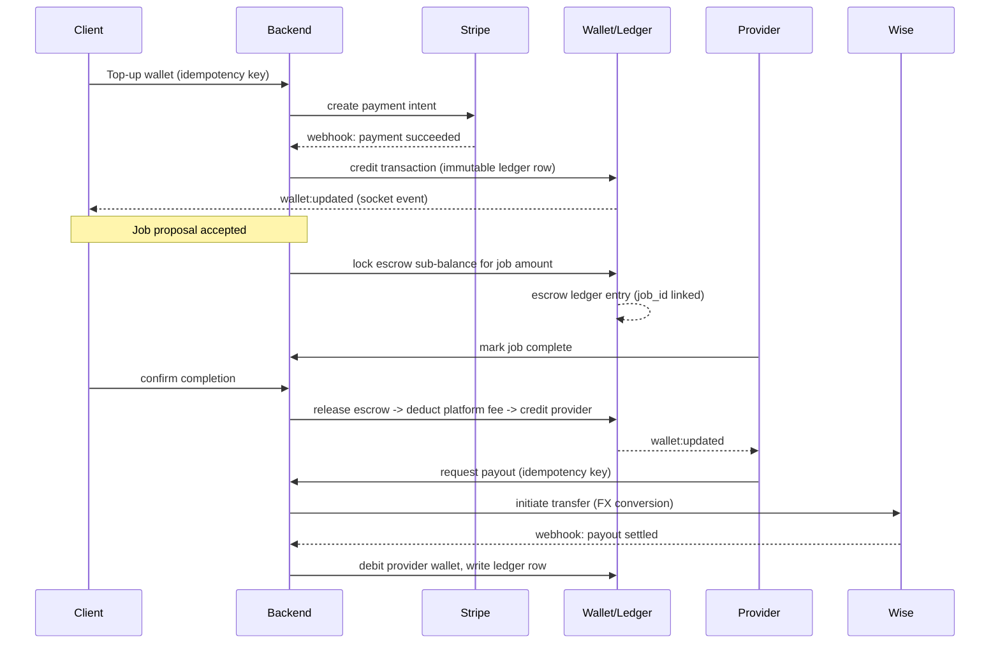

Rules:

- Ledger-first, immutable transactions. Corrections happen via offsetting entries plus audit logs.
- Amounts are normalized internally to USD, while display currency comes from cached FX rates.
- Idempotency keys are required for wallet top-up confirmation, escrow lock/release, and payout initiation.
- Atomic balance updates and reconciliation jobs are required wherever money moves.

### 4.5 Dispute Resolution

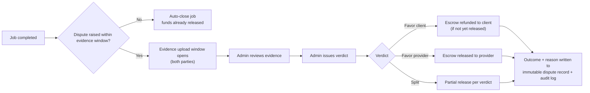

### 4.6 Fraud Pipeline

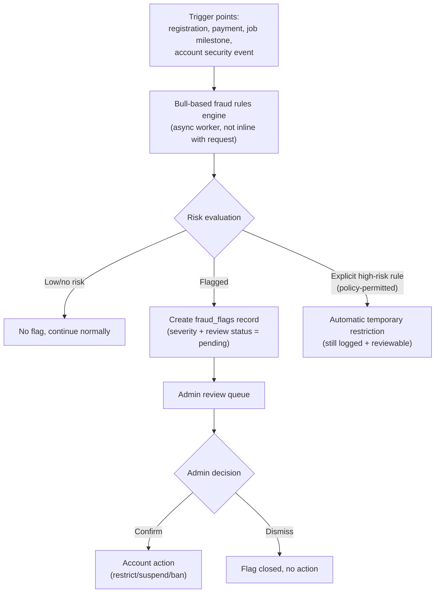

Rule: no automatic permanent bans without admin approval. The only exception is an explicitly policy-approved high-risk auto-rule, and even that remains reviewable and logged.

### 4.7 Realtime Messaging and Notifications

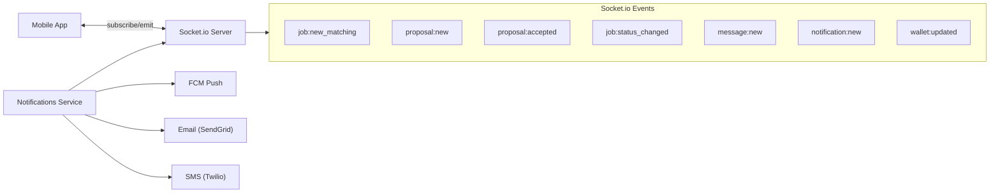

`messages` collection fields: `_id, job_id (nullable), conversation_id, sender_id, receiver_id, body, attachments[], message_type(text|image|file|system), read_by[], created_at, updated_at, deleted_at(soft delete)`.

## 5. State Machines

### 5.1 KYC States

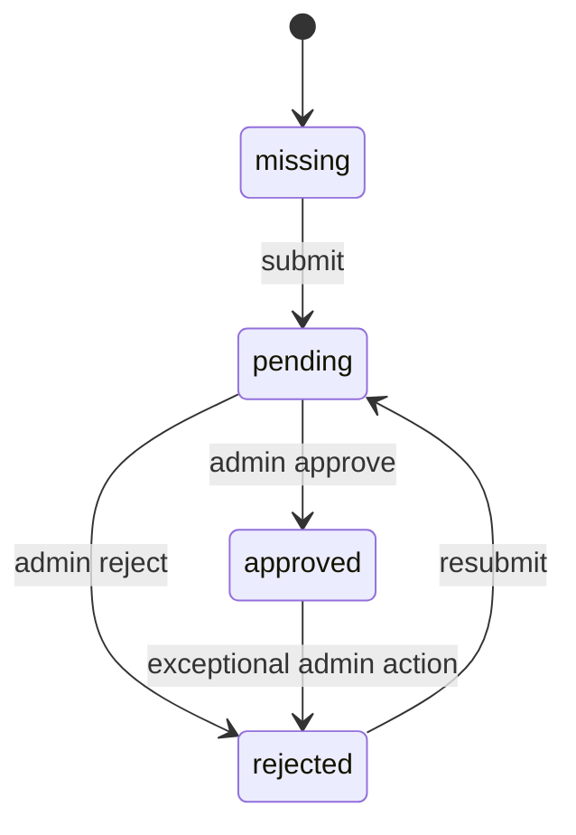

### 5.2 Provider Access Gate

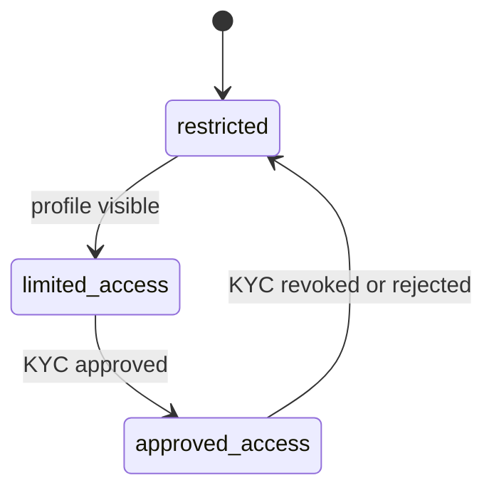

### 5.3 Proposal States

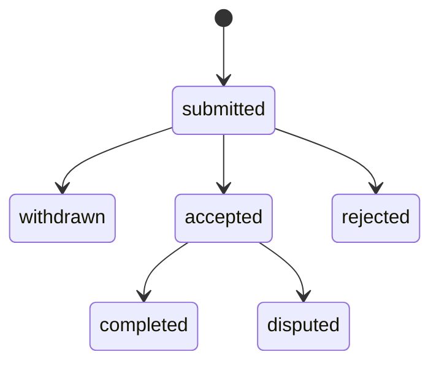

## 6. Backend Module Map

### Auth module

- Register, login, logout, refresh token, OTP verification, password reset.
- Owns identity lifecycle and session/token behavior.

### KYC module

- Provider identity document submission.
- Signed upload URL issuance.
- Admin review and approval/rejection.
- Provider identity trust gating.

### Verification module

- Category and skill management (skill_categories, skill_items collections).
- Provider category/skill selection.
- Physical verification: certificate/license upload, prior work photos.
- Digital verification: certificate upload, portfolio links, OAuth platform integration.
- Skill test engine (MCQ MVP).
- Verification records with status state machine (draft/pending_review/scheduled/auto_approved/approved/rejected/expired).
- Admin review queue with immutable audit trail.
- Auto-verification workers for credential URLs, OAuth signals, and skill tests.
- Provider.overall_status aggregator (incomplete/pending/partially_verified/verified/rejected).
- Resume upload and parsing pipeline.

### Jobs module

- Job creation, browsing, status transitions, assignment flow.

### Proposals module

- Provider proposals, acceptance, rejection, withdrawal.

### Wallet module

- Wallet balances, escrow lock/release, ledger entries, payout requests.

### Notifications module

- In-app notifications and event fanout.

### Disputes module

- Dispute creation, evidence, admin resolution.

### Fraud module

- Event-driven risk flags and review workflow.

## 7. API and Data Conventions

### API conventions

- All endpoints are versioned under `/api/v1`.
- Write endpoints use strict validation.
- Responses keep the existing success/data/meta envelope.
- Sensitive operations are idempotent when money or state transitions are involved.

### Data model themes

- Users, provider profiles, jobs, proposals, wallets, transactions, reviews, notifications, fraud flags, KYC documents, audit logs, messages, skill_categories, skill_items, verification_records, admin_reviews, resume_parse_results.
- Financial and status history should be append-only wherever possible.
- Avoid hard delete for sensitive records.

## 8. Security Model

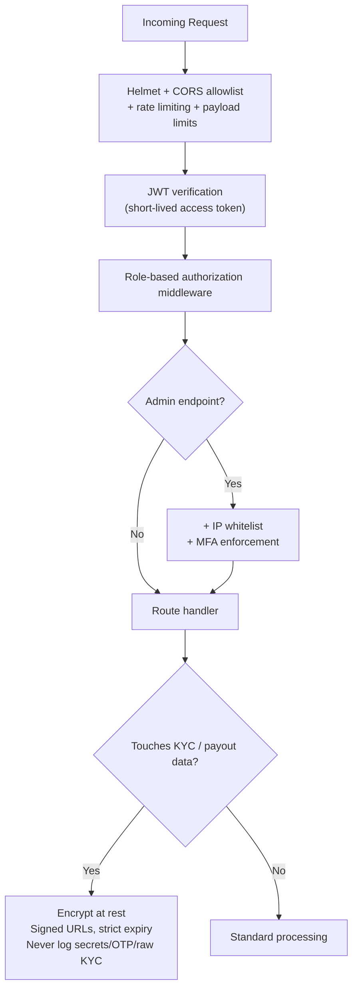

Additional rules:

- Refresh token rotation with revocation tracking and device/session tracking for anomaly detection.
- Double-entry-style ledger checks, atomic balance updates, and reconciliation jobs for Stripe/Wise callbacks.
- Structured JSON logs with `request_id` and `user_id`; immutable admin action audit logs.

## 9. Mobile Frontend Structure and Conventions

### 9.1 Folder Structure

```text
mobile/
├── app/                          Expo Router routes
│   ├── (auth)/                   login, register, otp-verify, forgot/reset password
│   ├── (onboarding)/             welcome (3-slide carousel), role-select
│   ├── (client)/                 home, post-job, my-jobs, job-detail/[id], proposals/[jobId], wallet, wallet-topup, wallet-withdraw, messages, profile
│   ├── (provider)/               home, browse-jobs, job-detail/[id], proposals, active-job/[id], earnings, kyc, profile
│   ├── (shared)/                 chat/[id], public-profile/[id], notifications, settings, raise-dispute/[jobId], leave-review/[jobId]
│   ├── (help)/                   index, faq, faq-detail/[id], live-chat, tickets, new-ticket, ticket-detail/[id], report, safety
│   ├── index.tsx                 Splash
│   ├── _layout.tsx               Root layout
│   └── +not-found.tsx
├── src/
│   ├── components/common/        Avatar, Badge, Button, Card, Input, Loader, BottomSheet, OTPInput, StarRating, ReviewCard, NotificationItem, ChatBubble, MapPreview
│   ├── components/job/           JobCard, ProposalCard, JobStatusBadge, CategoryGrid
│   ├── components/wallet/        TransactionItem
│   ├── context/                  AuthContext, ThemeContext
│   ├── hooks/                    useAuth, useTheme, useColorScheme(.web)
│   ├── navigation/               AppNavigator, ClientTabs, ProviderTabs
│   ├── services/                 api.ts, authService, jobService, socketService, walletService
│   ├── theme/                    colors.ts, typography.ts, index.ts
│   └── utils/                    formatCurrency, storage, validators
```

51 screens total across Onboarding, Auth, Client, Provider, Shared, and Help & Support groups.

### 9.2 Theme System

Both light and dark themes are switched automatically by the device system setting. Never hardcode hex colors in a screen; always resolve through `Colors.light` / `Colors.dark` via `useColorScheme()`.

Core colors:

- primary: `#1A9E8F`
- primaryMid: `#7ABFB8`
- primaryLight: `#E0F4F2` / `#0F3330`
- primaryDark: `#0D7A6E` / `#0F3330`
- amber: `#F5A623`
- amberLight: `#FEF3DC` / `#2A1F00`
- success: `#27AE60`
- error: `#E74C3C`
- warning: `#F39C12`

No blue palette anywhere in product UI.

Mandatory pattern in every screen:

```tsx
const scheme = useColorScheme();
const isDark = scheme === 'dark';
const C = isDark ? Colors.dark : Colors.light;
const styles = makeStyles(C);
```

### 9.3 Spacing, Radius, and Sizing System

| Token | Value |
|---|---|
| Screen horizontal padding | 20px |
| Section gap | 24px |
| Card internal padding | 16px |
| Between elements | 12px |
| Tight gap | 8px |
| Card radius | 16px |
| Button radius | 12px |
| Input radius | 10px |
| Pill radius | 20px / 9999 |
| Button height (large) | 52px |
| Button height (medium) | 44px |
| Input height | 52px |
| Bottom nav height | 60px + safe area |
| Min touch target | 44px |

### 9.4 Mandatory Screen Rules

1. TypeScript only, never `.js` or `.jsx`.
2. Theme resolved via `useColorScheme()` at the top of every screen, `makeStyles(C)` at the bottom.
3. Wrap every screen root in `SafeAreaView`.
4. Use `ScrollView` for tall content and `KeyboardAvoidingView` around forms.
5. Use `FlatList` for any list larger than five items.
6. Show loading, empty, and error states explicitly.
7. Use `router.replace` for auth transitions after login/logout.
8. Keep route files in `mobile/app` and business logic in `mobile/src`.

## 10. Delivery Roadmap

```mermaid
gantt
    title Do It Platform - Phase Roadmap (relative sprints)
    dateFormat  X
    axisFormat %s
    section Foundations
    Phase 0 Program Setup             :p0, 0, 1
    Phase 1 Auth & Identity           :p1, after p0, 1
    Phase 2 KYC & Identity Verification:p2, after p1, 1
    Provider Onboarding & Verification:p2b, after p2, 2
    section Core Marketplace
    Phase 4 Jobs Core                 :p4, after p2b, 1
    Phase 5 Proposals & Matching      :p5, after p4, 1
    section Money
    Phase 6 Wallet/Escrow/Ledger      :p6, after p5, 2
    Phase 7 Payouts/FX/Multi-currency :p7, after p6, 1
    section Trust
    Phase 8 Disputes & Reviews        :p8, after p7, 1
    Phase 9 Messaging & Realtime      :p9, after p8, 1
    Phase 10 Fraud & Security         :p10, after p9, 1
    section Completion
    Phase 11 Mobile Frontend + QA     :p11, after p10, 2
    Phase 12 Website + Admin (deferred):p12, after p11, 2
    Phase 13 Perf & Stabilization     :p13, after p12, 1
    Phase 14 Launch & Post-launch     :p14, after p13, 1
```

Current repository truth from [IMPLEMENTATION_STATUS.md](IMPLEMENTATION_STATUS.md): Phases 0, 1, and 2 are completed, and Phase 3 (Provider Onboarding & Verification System) is the active implementation phase.

## 11. Development Mode Behavior

The repository already uses a development OTP/debug mode. When enabled, the backend can bypass provider delivery so local work does not require live SendGrid or Twilio credentials.

Use this only for development and testing. Production should keep real provider delivery enabled.

## 12. What an LLM Should Infer

If a new LLM is given this pack, it should understand:

- The product is a marketplace with separate client and provider experiences.
- The backend is the source of truth for business rules.
- Provider access is gated by KYC identity approval and per-category skill verification.
- Jobs move through a controlled lifecycle with escrow and dispute handling.
- Payments are ledger-based and idempotent.
- Notifications and realtime updates are event-driven side effects.
- Mobile is the active frontend; website and admin UI are deferred.

## 13. Suggested Reading Order for Another LLM

1. [LLM_ARCHITECTURE_PACK.md](LLM_ARCHITECTURE_PACK.md) (this file — start here)
2. [IMPLEMENTATION_STATUS.md](IMPLEMENTATION_STATUS.md) (current progress truth)
3. [DO_IT_MASTER_DOCUMENTATION.md](DO_IT_MASTER_DOCUMENTATION.md)
4. [IMPLEMENTATION_PHASES.md](IMPLEMENTATION_PHASES.md)
5. [detail_for_frontend.md](detail_for_frontend.md)
6. [HANDOFF_PROMPT.md](HANDOFF_PROMPT.md)
7. [DO_IT_PROVIDER_ONBOARDING_skill_VERIFICATION_MERMAID.md](DO_IT_PROVIDER_ONBOARDING_skill_VERIFICATION_MERMAID.md) (Phase 3 detailed design)

That reading order gives a new model the current truth, the product design, the phased roadmap, and the mobile implementation conventions.