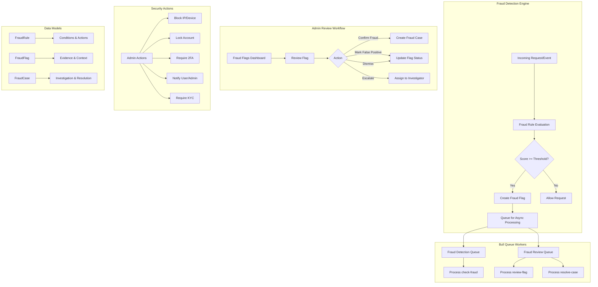
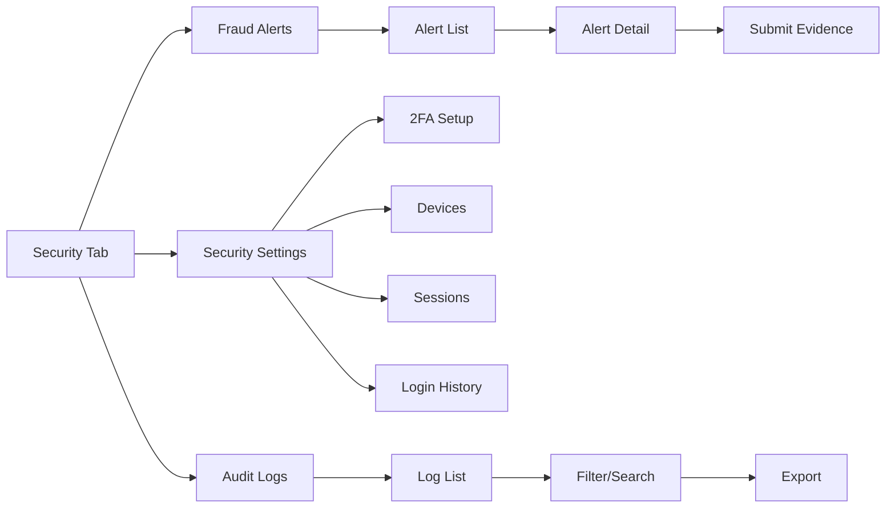

# Phase 10: Fraud Detection and Security Hardening

## Overview

Phase 10 implements a comprehensive fraud detection system and security hardening measures for the Do It Platform. This phase introduces a rules-based fraud engine, automated flag review workflows, admin security actions, and audit logging capabilities.

## Architecture



## Components

### 1. Fraud Rules Engine (`/backend/src/modules/fraud/`)

#### Data Models

**FraudRule** - Configurable detection rules:
```typescript
interface IFraudRule {
  name: string;
  description: string;
  type: FraudRuleType;
  severity: FraudSeverity;
  enabled: boolean;
  conditions: Record<string, any>;
  actions: FraudAction[];
  scoreThreshold: number;      // 0-100
  windowMs: number;            // Time window
  maxTriggers: number;         // Max triggers before action
  cooldownMs: number;          // Cooldown between triggers
}
```

**Supported Rule Types:**
- `velocity_check` - Request frequency from same IP/device/user
- `geo_anomaly` - Location anomalies for user
- `device_fingerprint` - Device consistency checks
- `ip_reputation` - IP threat intelligence
- `payment_velocity` - Payment frequency/amounts
- `account_takeover` - Account takeover patterns
- `bot_detection` - Bot-like behavior
- `card_testing` - Card testing patterns
- `account_creation_spam` - Mass account creation
- `promo_abuse` - Promotional abuse
- `chargeback_risk` - Chargeback risk assessment
- `custom` - Custom rule logic

**FraudFlag** - Triggered rule instances:
```typescript
interface IFraudFlag {
  userId: ObjectId;
  ruleId: ObjectId;
  ruleName: string;
  ruleType: FraudRuleType;
  severity: FraudSeverity;
  score: number;
  triggeredAt: Date;
  status: FraudStatus;
  evidence: Record<string, any>;
  context: {
    ip?: string;
    deviceId?: string;
    userAgent?: string;
    location?: { country: string; city: string; lat: number; lng: number };
    deviceFingerprint?: string;
    sessionId?: string;
    requestId?: string;
  };
  actionsTaken: FraudAction[];
  reviewedBy?: ObjectId;
  reviewedAt?: Date;
  reviewNotes?: string;
  resolvedAt?: Date;
}
```

**FraudCase** - Investigation cases:
```typescript
interface IFraudCase {
  userId: ObjectId;
  flags: ObjectId[];
  status: 'open' | 'investigating' | 'resolved' | 'closed';
  assignedTo?: ObjectId;
  priority: 'low' | 'medium' | 'high' | 'critical';
  summary: string;
  investigatorNotes?: string;
  resolution?: 'fraud_confirmed' | 'false_positive' | 'insufficient_evidence' | 'user_educated' | 'account_closed';
  resolvedAt?: Date;
  resolvedBy?: ObjectId;
}
```

#### Fraud Service (`fraud.service.ts`)

**Core Methods:**
- `createFraudRule()` - Create new detection rule
- `getFraudRules()` - List rules with filters
- `checkFraud(context)` - Evaluate all enabled rules against context
- `createFraudFlag()` - Create flag from triggered rule
- `getFraudFlags()` - Query flags with filters
- `reviewFraudFlag()` - Admin review workflow
- `submitEvidence()` - User submits evidence for flag
- `createFraudCase()` - Create investigation case
- `getFraudCases()` - Query cases
- `resolveFraudCase()` - Resolve case with outcome
- `applyFraudAction()` - Execute security action
- `bulkUpdateFlags()` - Batch flag operations
- `exportFraudFlags()` - Export flags (CSV/JSON)
- `getFraudStats()` - Aggregated statistics

**Queue Integration (Bull):**
```typescript
// Two queues for different processing needs
const fraudQueue = new Queue('fraud-detection', REDIS_URL);
const fraudDetectionQueue = new Queue('fraud-analysis', REDIS_URL);

// Job processors
fraudDetectionQueue.process('check-fraud', async (job) => {
  return fraudService.checkFraud(job.data.context);
});

fraudQueue.process('review-flag', async (job) => {
  await fraudService.reviewFraudFlag(job.data.flagId, job.data.adminId, job.data);
});

fraudQueue.process('resolve-case', async (job) => {
  await fraudService.resolveFraudCase(job.data.caseId, job.data.adminId, job.data);
});
```

#### API Endpoints (`fraud.routes.ts`)

| Method | Endpoint | Description | Auth |
|--------|----------|-------------|------|
| POST | `/api/v1/fraud/rules` | Create fraud rule | Admin |
| GET | `/api/v1/fraud/rules` | List fraud rules | Admin |
| GET | `/api/v1/fraud/rules/:ruleId` | Get rule by ID | Admin |
| PATCH | `/api/v1/fraud/rules/:ruleId` | Update rule | Admin |
| DELETE | `/api/v1/fraud/rules/:ruleId` | Delete rule | Admin |
| GET | `/api/v1/fraud/flags` | List fraud flags | Admin/User* |
| GET | `/api/v1/fraud/flags/:flagId` | Get flag details | Admin/User* |
| POST | `/api/v1/fraud/flags/:flagId/evidence` | Submit evidence | User |
| POST | `/api/v1/fraud/flags/:flagId/review` | Review flag (admin) | Admin |
| POST | `/api/v1/fraud/flags/bulk` | Bulk update flags | Admin |
| GET | `/api/v1/fraud/cases` | List fraud cases | Admin |
| GET | `/api/v1/fraud/cases/:caseId` | Get case details | Admin |
| PATCH | `/api/v1/fraud/cases/:caseId` | Update case | Admin |
| POST | `/api/v1/fraud/cases/:caseId/resolve` | Resolve case | Admin |
| POST | `/api/v1/fraud/actions` | Apply security action | Admin |
| POST | `/api/v1/fraud/block-ip` | Block IP address | Admin |
| POST | `/api/v1/fraud/block-device` | Block device | Admin |
| POST | `/api/v1/fraud/lock-account` | Lock user account | Admin |
| POST | `/api/v1/fraud/require-2fa` | Require 2FA for user | Admin |
| POST | `/api/v1/fraud/notify-user` | Send user notification | Admin |
| POST | `/api/v1/fraud/notify-admin` | Send admin notification | Admin |
| GET | `/api/v1/fraud/stats` | Get fraud statistics | Admin |
| GET | `/api/v1/fraud/export` | Export fraud flags | Admin |

*Users can only view their own flags

### 2. Security Hardening

#### Admin Security Actions
- **Block IP**: Block malicious IP addresses at infrastructure level
- **Block Device**: Block specific device fingerprints
- **Lock Account**: Temporarily/permanently lock user accounts
- **Require 2FA**: Force two-factor authentication
- **Notify User**: Send security notifications via multiple channels
- **Notify Admin**: Alert security team
- **Require KYC**: Trigger KYC verification
- **Challenge**: Present CAPTCHA/challenge
- **Monitor**: Enhanced monitoring for user

#### Abuse Controls
- Rate limiting on sensitive endpoints
- Automated fraud detection on:
  - Job creation
  - Proposal submission
  - Payment initiation
  - Account registration
  - Login attempts

### 3. Mobile Screens (`/mobile/src/screens/security/`)

#### FraudAlertsScreen
- Real-time fraud alert notifications
- Flag details with evidence
- Submit evidence flow
- Status tracking (pending/reviewed/resolved)

#### SecuritySettingsScreen
- 2FA management (TOTP/SMS)
- Device management (view/revoke)
- Login history
- Session management
- Security preferences

#### AuditLogViewerScreen
- Paginated audit log display
- Filter by action, date, user
- Export capabilities
- Real-time updates



### 4. Validation Schemas (`fraud.validation.ts`)

Comprehensive Joi validation for all endpoints:
- Rule CRUD operations
- Flag queries and reviews
- Case management
- Security actions
- Bulk operations
- Export parameters
- Statistics queries

### 5. Real-time Integration

WebSocket events for fraud notifications:
- `fraud_flag_created` - New flag triggered
- `fraud_flag_reviewed` - Admin reviewed flag
- `fraud_case_created` - New case opened
- `fraud_case_resolved` - Case resolved
- `security_action_applied` - Admin action executed

## Configuration

### Environment Variables
```env
# Redis for Bull queues
REDIS_URL=redis://localhost:6379

# Fraud detection thresholds
FRAUD_DEFAULT_THRESHOLD=70
FRAUD_VELOCITY_WINDOW_MS=300000
FRAUD_MAX_TRIGGERS=10
FRAUD_COOLDOWN_MS=300000
```

### Default Rules (Seeded on Init)
1. **Velocity Check** - >10 requests/min from same IP
2. **Geo Anomaly** - Login from new country
3. **Device Fingerprint** - New device for existing user
4. **IP Reputation** - Known malicious IP
5. **Payment Velocity** - >3 payments/hour
6. **Account Takeover** - Password change + new device
7. **Bot Detection** - Non-human behavior patterns

## Testing

### Unit Tests
```bash
# Run fraud module tests
npm test -- --filter=fraud
```

### Integration Tests
```bash
# Test fraud detection flow
npm test -- --testNamePattern="fraud detection"
```

### Manual Testing Checklist
- [ ] Create fraud rule via API
- [ ] Trigger rule via checkFraud()
- [ ] Verify flag created in database
- [ ] Review flag as admin
- [ ] Submit evidence as user
- [ ] Create case from confirmed fraud
- [ ] Resolve case with outcome
- [ ] Apply security actions (block IP, lock account)
- [ ] Export flags as CSV
- [ ] View statistics dashboard
- [ ] Test mobile fraud alerts screen
- [ ] Test security settings screen
- [ ] Test audit log viewer

## Deployment Notes

### Database Indexes
```javascript
// FraudRule indexes
db.fraudrules.createIndex({ type: 1, enabled: 1 });
db.fraudrules.createIndex({ severity: 1, enabled: 1 });

// FraudFlag indexes
db.fraudflags.createIndex({ userId: 1, status: 1 });
db.fraudflags.createIndex({ ruleId: 1 });
db.fraudflags.createIndex({ triggeredAt: -1 });
db.fraudflags.createIndex({ severity: 1, status: 1 });

// FraudCase indexes
db.fraudcases.createIndex({ userId: 1, status: 1 });
db.fraudcases.createIndex({ assignedTo: 1, status: 1 });
db.fraudcases.createIndex({ createdAt: -1 });
```

### Queue Monitoring
```bash
# Monitor Bull queues
npm run queue:monitor

# Check job status
redis-cli LLEN bull:fraud-detection:wait
redis-cli LLEN bull:fraud-analysis:wait
```

### Scaling Considerations
- Run queue workers on separate instances
- Use Redis Cluster for high availability
- Configure appropriate concurrency for queue processors
- Set up dead letter queues for failed jobs

## Future Enhancements

1. **ML-based Detection** - Integrate ML models for anomaly detection
2. **Risk Scoring** - Dynamic user risk scores
3. **Graph Analysis** - Detect fraud rings via relationship analysis
4. **Automated Response** - Auto-block on critical severity
5. **Integration** - Connect with external fraud databases
6. **Dashboard** - Admin fraud analytics dashboard
7. **Webhooks** - Notify external systems of fraud events

## Compliance

- **GDPR**: User data in flags/cases handled per privacy policy
- **PCI DSS**: Payment-related fraud detection
- **SOX**: Audit trail for financial fraud
- **Data Retention**: Configurable retention for flags/cases