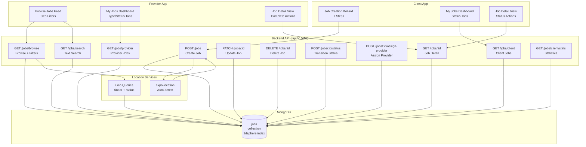
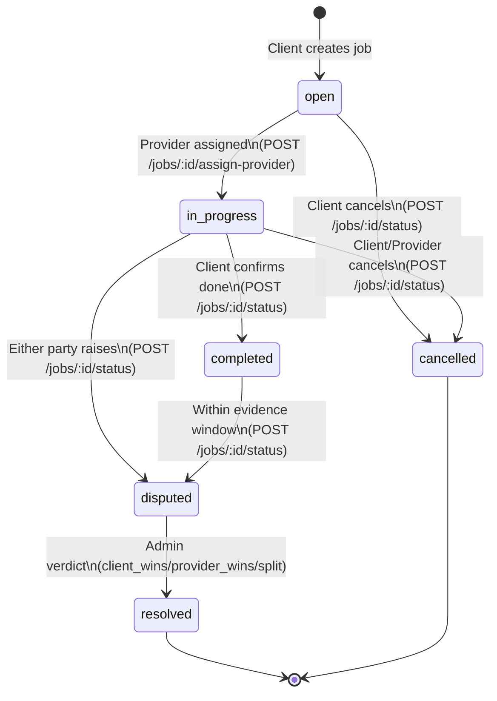
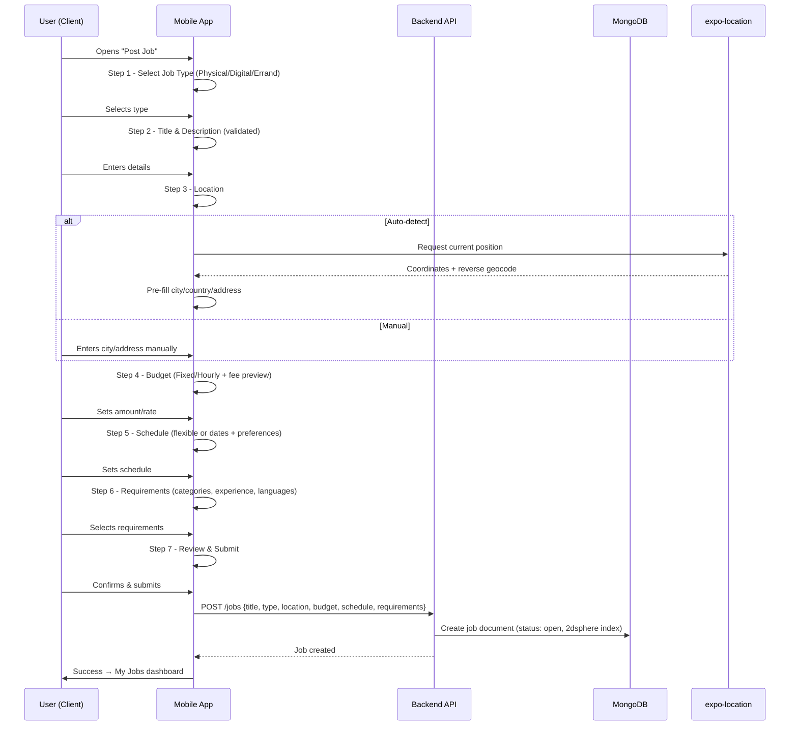
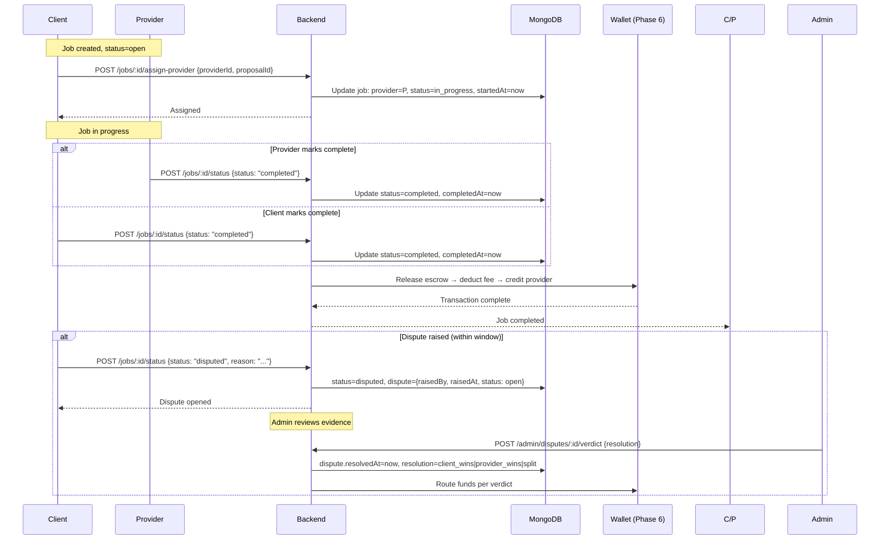
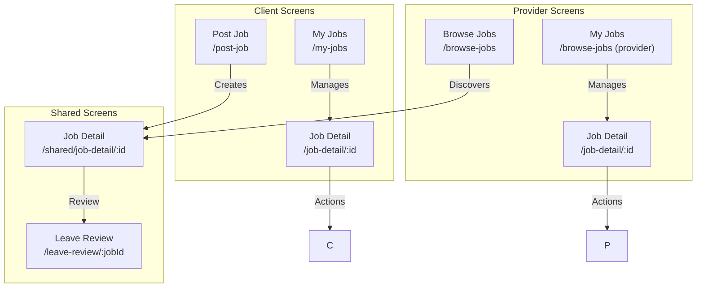

# Do It Platform - Phase 4: Jobs Core (Create, Browse, Manage)

## Overview

Phase 4 implements the core job marketplace functionality: clients create jobs, providers browse and apply to jobs, and both parties manage job lifecycle through a controlled state machine. This phase establishes the foundation for the matching engine (Phase 5) and escrow/payments (Phase 6).

**Duration**: 1 sprint
**Status**: ✅ Completed
**Completion Date**: 2026-08-11

---

## Architecture



---

## Job State Machine



### Permission Matrix

| Transition | Client (Owner) | Assigned Provider | Admin |
|------------|---------------|-------------------|-------|
| open → in_progress | ❌ | ❌ | ✅ (assign) |
| open → cancelled | ✅ | ❌ | ✅ |
| in_progress → completed | ✅ | ✅ | ✅ |
| in_progress → cancelled | ✅ | ✅ | ✅ |
| in_progress → disputed | ✅ | ✅ | ✅ |
| completed → disputed | ✅ | ✅ | ✅ |
| disputed → resolved | ❌ | ❌ | ✅ |

---

## Job Creation Flow (Client)



---

## Provider Browse & Matching

```mermaid
flowchart TD
    subgraph Browse["Provider Browse Flow"]
        A[Open Browse Jobs] --> B{Geo Available?}
        B -->|Yes| C[Auto-detect Location]
        B -->|No| D[Manual City/Radius]
        C --> E[GET /jobs/browse\nlat/lng + radius]
        D --> E
        E --> F{Apply Filters?}
        F -->|Type| G[Job Type: Physical/Digital/Errand]
        F -->|Category| H[Skill Category]
        F -->|Budget| I[Min/Max + Type]
        F -->|Experience| J[Entry/Intermediate/Expert]
        F -->|Sort| K[Newest/Budget/Distance/Urgency]
        G --> L[MongoDB Query\n2dsphere + Filters]
        H --> L
        I --> L
        J --> L
        K --> L
        L --> M[Return Paginated Results\n+ Distance]
        M --> N[Render Feed\nStats Tabs + Cards]
        N --> O{Job Selected?}
        O -->|Yes| P[Job Detail Screen]
        P --> Q{Provider Action?}
        Q -->|Apply| R[Phase 5: Submit Proposal]
        Q -->|Save| S[Bookmark - Phase 5]
    end

    subgraph GeoQuery["Geo Query Logic"]
        L1[2dsphere Index on job.location] --> L2
        L2[$near Query\nlat/lng + maxDistance] --> L3
        L3[Filter by type/status/filters] --> L4
        L4[Sort by distance/budget/date] --> L5
        L5[Limit + Skip] --> L6[Return Jobs with distance]
    end
```



---

## Job Detail & Management (Client & Provider)



---

## Data Model

```mermaid
erDiagram
    JOB ||--o{ CATEGORY : "requires"
    JOB ||--o{ SKILL_ITEM : "requires"
    JOB }|--|| USER : "client"
    JOB }|--o| USER : "provider"
    JOB ||--o| PROPOSAL : "has"
    JOB ||--o| DISPUTE : "may have"
    JOB ||--o| REVIEW : "may have"

    JOB {
        ObjectId _id PK
        string title
        string description
        enum type "physical|digital|errand"
        enum status "open|in_progress|completed|cancelled|disputed|resolved"
        object location {Point, coordinates, address, city, country}
        object budget {type, amount, currency, hourlyRate, estimatedHours}
        object schedule {startsAt, endsAt, timezone, isFlexible, preferredDays[], preferredShifts[]}
        object requirements {categories[], skillItems[], experienceLevel, languages[], certificationsRequired, vehicleRequired}
        object client {clientId, clientName, clientAvatar}
        object provider {providerId, providerName, providerAvatar, acceptedProposalId, startedAt, completedAt}
        object escrow {lockedAmount, lockedAt, releasedAt, platformFeeAmount, platformFeePercent, transactionId}
        object dispute {disputeId, raisedBy, raisedAt, reason, status, resolution, resolvedAt, resolvedBy}
        object review {clientReview, providerReview}
        object metadata {views, applicationsCount, source, tags[], isUrgent, isFeatured}
        datetime createdAt
        datetime updatedAt
    }

    USER ||--o{ JOB : "posts (client)"
    USER ||--o{ JOB : "assigned (provider)"
```

---

## API Endpoints Summary

```mermaid
graph LR
    subgraph Jobs["/api/v1/jobs"]
        POST["POST /jobs\nCreate (client)"]
        GET_ID["GET /jobs/:id\nDetail"]
        PATCH["PATCH /jobs/:id\nUpdate (client, open)"]
        DELETE["DELETE /jobs/:id\nDelete (client, open/cancelled)"]
        BROWSE["GET /jobs/browse\nGeo + Filters"]
        SEARCH["GET /jobs/search\nText Search"]
        CLIENT["GET /jobs/client\nClient's Jobs"]
        PROVIDER["GET /jobs/provider\nProvider's Jobs"]
        STATS_C["GET /jobs/client/stats\nClient Stats"]
        STATS_P["GET /jobs/provider/stats\nProvider Stats"]
        STATUS["POST /jobs/:id/status\nTransition"]
        ASSIGN["POST /jobs/:id/assign-provider\nAssign Provider"]
    end

    style POST fill:#e8f5e9
    style BROWSE fill:#e3f2fd
    style STATUS fill:#fff3e0
```



### Request/Response Examples

**Create Job (POST /jobs)**
```json
{
  "title": "Living room painting",
  "description": "Need 2 coats of paint on living room walls...",
  "type": "physical",
  "location": {
    "coordinates": [-122.4194, 37.7749],
    "city": "San Francisco",
    "country": "US",
    "formattedAddress": "123 Main St, San Francisco, CA"
  },
  "budget": {
    "type": "fixed",
    "amount": 50000,
    "currency": "USD"
  },
  "schedule": {
    "isFlexible": true,
    "timezone": "UTC-8",
    "preferredDays": ["Mon", "Tue", "Wed"],
    "preferredShifts": ["Morning", "Afternoon"]
  },
  "requirements": {
    "categories": ["cat-id-1", "cat-id-2"],
    "experienceLevel": "intermediate",
    "languages": ["en"],
    "certificationsRequired": false,
    "vehicleRequired": false
  }
}
```

**Browse Jobs (GET /jobs/browse)**
```bash
GET /jobs/browse?type=physical&latitude=37.7749&longitude=-122.4194&radiusKm=25&minBudget=10000&maxBudget=100000&sortBy=distance&sortOrder=asc&limit=20
```

**Response**
```json
{
  "success": true,
  "data": {
    "jobs": [
      {
        "_id": "job-id",
        "title": "Living room painting",
        "type": "physical",
        "status": "open",
        "budget": { "type": "fixed", "amount": 50000, "currency": "USD" },
        "location": { "city": "San Francisco", "coordinates": [-122.4194, 37.7749] },
        "metadata": { "views": 15, "applicationsCount": 3, "isUrgent": false },
        "distance": 2500
      }
    ],
    "total": 42,
    "limit": 20,
    "skip": 0
  }
}
```

**Transition Status (POST /jobs/:id/status)**
```json
{
  "status": "completed"
}
```

---

## Mobile Screens



### Screen Details

| Screen | Route | Purpose |
|--------|-------|---------|
| Job Creation Wizard | `/post-job` | 7-step flow with validation |
| Client Job Dashboard | `/my-jobs` | Tabbed view with stats, job cards |
| Provider Browse Feed | `/browse-jobs` | Geo-aware feed with filters |
| Provider Job Dashboard | `/browse-jobs` (provider tab) | Assigned jobs with actions |
| Job Detail | `/job-detail/:id` | Full view + status actions |
| Leave Review | `/leave-review/:jobId` | Post-completion rating |

---

## Verification Checklist

| Component | Status |
|-----------|--------|
| Backend TypeScript | ✅ Clean |
| Backend Tests (12/12) | ✅ Pass |
| Mobile TypeScript | ✅ Clean |
| Job Model & Indexes | ✅ Created |
| Validation Schemas | ✅ Complete |
| Service Layer | ✅ Complete |
| Controller & Routes | ✅ Mounted |
| Mobile Job Service | ✅ Typed |
| Job Creation Wizard | ✅ 7 Steps |
| Browse Feed | ✅ Geo + Filters |
| Job Detail | ✅ Role-based Actions |
| Client Dashboard | ✅ Status Tabs |
| Provider Dashboard | ✅ Type/Status Tabs |
| Status State Machine | ✅ Enforced |
| Geo Queries | ✅ 2dsphere + $near |
| Auto-location | ✅ expo-location |

---

## Next Phase Dependencies

| Phase | Dependency |
|-------|------------|
| Phase 5: Proposals | Requires Job model + browse/detail endpoints |
| Phase 6: Wallet/Escrow | Requires job status transitions + assignProvider |
| Phase 8: Disputes | Requires dispute tracking in Job model |
| Phase 9: Notifications | Requires job events (created, assigned, completed) |

---

## Files Created/Modified

### Backend
```
backend/src/modules/jobs/
├── job.model.ts          # Job schema + indexes + methods
├── job.validation.ts     # Joi schemas
├── job.service.ts        # Business logic
├── job.controller.ts     # HTTP handlers
├── job.routes.ts         # Route definitions
backend/src/routes/index.ts  # Mounted jobs router
```

### Mobile
```
mobile/src/services/jobService.ts          # API client
mobile/src/context/JobCreationContext.tsx  # Wizard state
mobile/src/components/jobs/
├── JobTypeStep.tsx
├── JobDetailsStep.tsx
├── JobLocationStep.tsx
├── JobBudgetStep.tsx
├── JobScheduleStep.tsx
├── JobRequirementsStep.tsx
├── JobReviewStep.tsx
mobile/app/(client)/
├── post-job.tsx          # Wizard entry
├── my-jobs.tsx           # Client dashboard
mobile/app/(provider)/
├── browse-jobs.tsx       # Provider feed + dashboard
mobile/app/(shared)/
├── job-detail/[jobId].tsx  # Shared detail
├── leave-review/[jobId].tsx  # Review screen
```

---

## Notes for Future Phases

1. **Escrow Integration (Phase 6)**: `job.escrow` fields ready; `assignProvider` should trigger escrow lock; `completed` status should trigger release.

2. **Proposals (Phase 5)**: Add `proposals` collection; `browseJobs` should show application count; providers need "Apply" action.

3. **Matching Engine (Phase 5)**: On job creation, trigger async matching job using job type, location, categories, and provider verification status.

4. **Notifications (Phase 9)**: Emit Socket.io events for job:created, job:assigned, job:status_changed.

5. **Admin Moderation**: Add admin endpoints for job moderation (feature/unfeature, remove inappropriate).

6. **Search Enhancement**: Add Elasticsearch/Algolia for full-text search across title, description, tags.