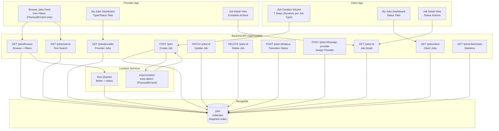
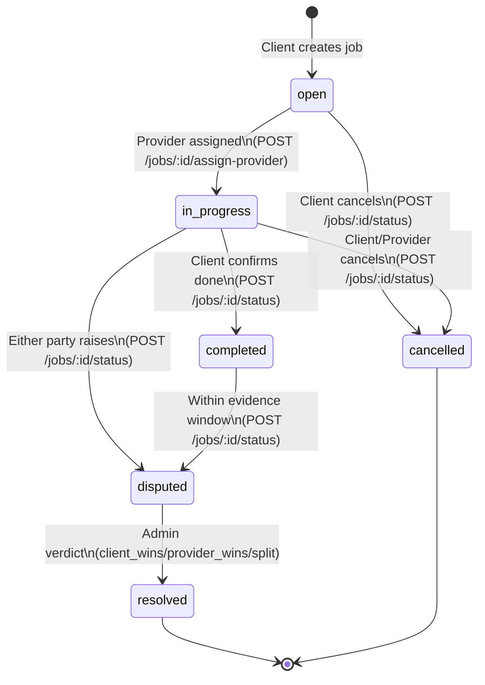
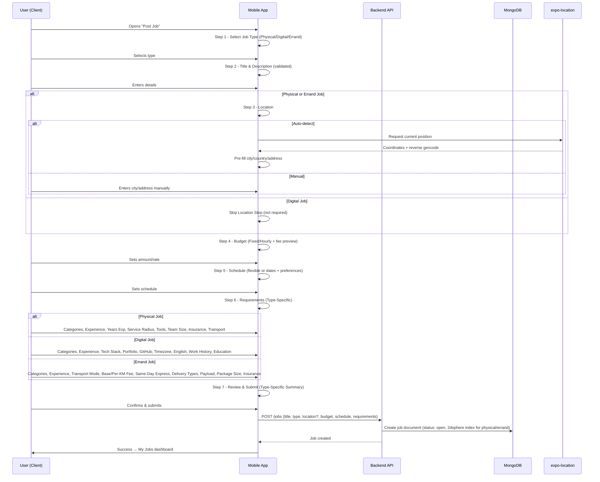
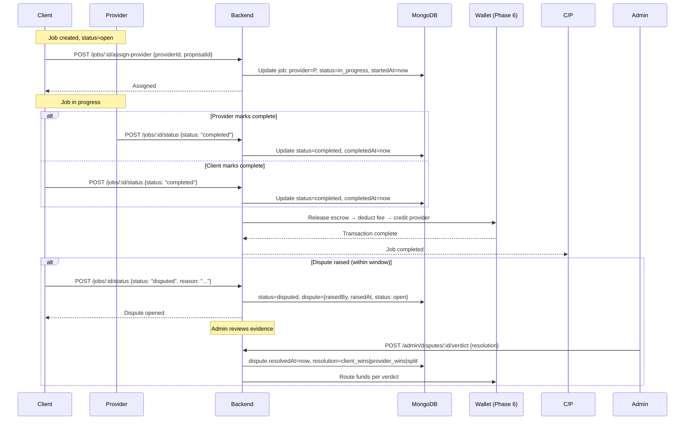
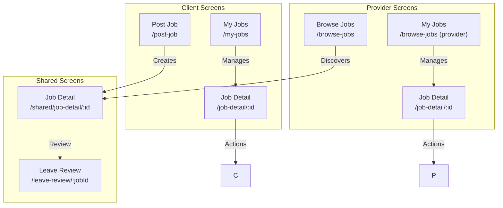

# Do It Platform - Phase 4: Jobs Core (Create, Browse, Manage)

## Overview

Phase 4 implements the core job marketplace functionality: clients create jobs, providers browse and apply to jobs, and both parties manage job lifecycle through a controlled state machine. This phase establishes the foundation for the matching engine (Phase 5) and escrow/payments (Phase 6).

**Duration**: 1 sprint
**Status**: ✅ Completed
**Completion Date**: 2026-08-11

---

## Architecture


```mermaid
flowchart TB
    subgraph Client["Client App"]
        CJW["Job Creation Wizard\n7 Steps (Dynamic per Job Type)"]
        CJM["My Jobs Dashboard\nStatus Tabs"]
        CJD["Job Detail View\nStatus Actions"]
    end

    subgraph Provider["Provider App"]
        PBF["Browse Jobs Feed\nGeo Filters (Physical/Errand only)"]
        PJM["My Jobs Dashboard\nType/Status Tabs"]
        PJD["Job Detail View\nComplete Actions"]
    end

    subgraph API["Backend API (/api/v1/jobs)"]
        JCR["POST /jobs\nCreate Job"]
        JBR["GET /jobs/browse\nBrowse + Filters"]
        JSR["GET /jobs/search\nText Search"]
        JDR["GET /jobs/:id\nJob Detail"]
        JUR["PATCH /jobs/:id\nUpdate Job"]
        JDEL["DELETE /jobs/:id\nDelete Job"]
        JST["POST /jobs/:id/status\nTransition Status"]
        JAP["POST /jobs/:id/assign-provider\nAssign Provider"]
        JCL["GET /jobs/client\nClient Jobs"]
        JPR["GET /jobs/provider\nProvider Jobs"]
        JSTS["GET /jobs/client/stats\nStatistics"]
    end

    subgraph DB["MongoDB"]
        JOB[("jobs\ncollection\n2dsphere index")]
    end

    subgraph Location["Location Services"]
        EXPO["expo-location\nAuto-detect (Physical/Errand)"]
        GEO["Geo Queries\n$near + radius"]
    end

    CJW --> JCR
    CJM --> JCL
    CJD --> JDR
    PBF --> JBR
    PBF --> JSR
    PJM --> JPR
    PJD --> JDR

    JCR --> JOB
    JBR --> JOB
    JSR --> JOB
    JDR --> JOB
    JUR --> JOB
    JDEL --> JOB
    JST --> JOB
    JAP --> JOB
    JCL --> JOB
    JPR --> JOB
    JSTS --> JOB

    JBR --> GEO
    GEO --> JOB
    JCR --> EXPO
    EXPO --> JCR
```

---

## Job State Machine


```mermaid
stateDiagram-v2
    [*] --> open: Client creates job
    
    open --> in_progress: Provider assigned\n(POST /jobs/:id/assign-provider)
    open --> cancelled: Client cancels\n(POST /jobs/:id/status)
    
    in_progress --> completed: Client confirms done\n(POST /jobs/:id/status)
    in_progress --> cancelled: Client/Provider cancels\n(POST /jobs/:id/status)
    in_progress --> disputed: Either party raises\n(POST /jobs/:id/status)
    
    completed --> disputed: Within evidence window\n(POST /jobs/:id/status)
    
    disputed --> resolved: Admin verdict\n(client_wins/provider_wins/split)
    
    resolved --> [*]
    cancelled --> [*]
```

### Permission Matrix

| Transition | Client (Owner) | Assigned Provider | Admin |
|------------|---------------|-------------------|-------|
| open → in_progress | ❌ | ❌ | ✅ (assign) |
| open → cancelled | ✅ | ❌ | ✅ |
| in_progress → completed | ✅ | ✅ | ✅ |
| in_progress → cancelled | ✅ | ✅ | ✅ |
| in_progress → disputed | ✅ | ✅ | ✅ |
| completed → disputed | ✅ | ✅ | ✅ |
| disputed → resolved | ❌ | ❌ | ✅ |

---

## Job Creation Flow (Client)


```mermaid
sequenceDiagram
    participant U as User (Client)
    participant App as Mobile App
    participant API as Backend API
    participant DB as MongoDB
    participant Loc as expo-location

    U->>App: Opens "Post Job"
    App->>App: Step 1 - Select Job Type (Physical/Digital/Errand)
    U->>App: Selects type
    App->>App: Step 2 - Title & Description (validated)
    U->>App: Enters details
    
    alt Physical or Errand Job
        App->>App: Step 3 - Location
        alt Auto-detect
            App->>Loc: Request current position
            Loc-->>App: Coordinates + reverse geocode
            App->>App: Pre-fill city/country/address
        else Manual
            U->>App: Enters city/address manually
        end
    else Digital Job
        App->>App: Skip Location Step (not required)
    end
    
    App->>App: Step 4 - Budget (Fixed/Hourly + fee preview)
    U->>App: Sets amount/rate
    App->>App: Step 5 - Schedule (flexible or dates + preferences)
    U->>App: Sets schedule
    App->>App: Step 6 - Requirements (Type-Specific)
    
    alt Physical Job
        U->>App: Categories, Experience, Years Exp, Service Radius, Tools, Team Size, Insurance, Transport
    else Digital Job
        U->>App: Categories, Experience, Tech Stack, Portfolio, GitHub, Timezone, English, Work History, Education
    else Errand Job
        U->>App: Categories, Experience, Transport Mode, Base/Per-KM Fee, Same-Day Express, Delivery Types, Payload, Package Size, Insurance
    end
    
    App->>App: Step 7 - Review & Submit (Type-Specific Summary)
    U->>App: Confirms & submits
    App->>API: POST /jobs {title, type, location?, budget, schedule, requirements}
    API->>DB: Create job document (status: open, 2dsphere index for physical/errand)
    API-->>App: Job created
    App->>U: Success → My Jobs dashboard
```

### Dynamic Step Flow by Job Type

| Job Type | Steps | Notes |
|----------|-------|-------|
| **Physical** | 7 steps | Includes Location (Step 3) |
| **Digital** | 6 steps | **Skips Location** - remote work |
| **Errand** | 7 steps | Includes Location (Step 3) |

---

## Provider Browse & Matching


```mermaid
flowchart TD
    subgraph Browse["Provider Browse Flow"]
        A[Open Browse Jobs] --> B{Geo Available?}
        B -->|Yes| C[Auto-detect Location]
        B -->|No| D[Manual City/Radius]
        C --> E[GET /jobs/browse\nlat/lng + radius]
        D --> E
        E --> F{Apply Filters?}
        F -->|Type| G[Job Type: Physical/Digital/Errand]
        F -->|Category| H[Skill Category]
        F -->|Budget| I[Min/Max + Type]
        F -->|Experience| J[Entry/Intermediate/Expert]
        F -->|Sort| K[Newest/Budget/Distance/Urgency]
        G --> L[MongoDB Query\n2dsphere + Filters]
        H --> L
        I --> L
        J --> L
        K --> L
        L --> M[Return Paginated Results\n+ Distance]
        M --> N[Render Feed\nStats Tabs + Cards]
        N --> O{Job Selected?}
        O -->|Yes| P[Job Detail Screen]
        P --> Q{Provider Action?}
        Q -->|Apply| R[Phase 5: Submit Proposal]
        Q -->|Save| S[Bookmark - Phase 5]
    end

    subgraph GeoQuery["Geo Query Logic"]
        L1[2dsphere Index on job.location] --> L2
        L2[$near Query\nlat/lng + maxDistance] --> L3
        L3[Filter by type/status/filters] --> L4
        L4[Sort by distance/budget/date] --> L5
        L5[Limit + Skip] --> L6[Return Jobs with distance]
    end
```

### Browse Behavior by Job Type

| Job Type | Geo Query | Distance Sort | Location Display |
|----------|-----------|---------------|------------------|
| **Physical** | ✅ Enabled | ✅ Enabled | ✅ Shown |
| **Digital** | ❌ Disabled | ❌ Disabled | ❌ Hidden |
| **Errand** | ✅ Enabled | ✅ Enabled | ✅ Shown |

---

## Job Detail & Management (Client & Provider)


```mermaid
sequenceDiagram
    participant C as Client
    participant P as Provider
    participant API as Backend
    participant DB as MongoDB
    participant WS as Wallet (Phase 6)

    Note over C,P: Job created, status=open
    
    C->>API: POST /jobs/:id/assign-provider {providerId, proposalId}
    API->>DB: Update job: provider=P, status=in_progress, startedAt=now
    API-->>C: Assigned
    
    Note over C,P: Job in progress
    
    alt Provider marks complete
        P->>API: POST /jobs/:id/status {status: "completed"}
        API->>DB: Update status=completed, completedAt=now
    else Client marks complete
        C->>API: POST /jobs/:id/status {status: "completed"}
        API->>DB: Update status=completed, completedAt=now
    end
    
    API->>WS: Release escrow → deduct fee → credit provider
    WS-->>API: Transaction complete
    API-->>C/P: Job completed
    
    alt Dispute raised (within window)
        C->>API: POST /jobs/:id/status {status: "disputed", reason: "..."}
        API->>DB: status=disputed, dispute={raisedBy, raisedAt, status: open}
        API-->>C: Dispute opened
        
        Note over API: Admin reviews evidence
        Admin->>API: POST /admin/disputes/:id/verdict {resolution}
        API->>DB: dispute.resolvedAt=now, resolution=client_wins|provider_wins|split
        API->>WS: Route funds per verdict
    end
```

---

## Data Model

```mermaid
erDiagram
    JOB ||--o{ CATEGORY : "requires"
    JOB ||--o{ SKILL_ITEM : "requires"
    JOB }|--|| USER : "client"
    JOB }|--o| USER : "provider"
    JOB ||--o| PROPOSAL : "has"
    JOB ||--o| DISPUTE : "may have"
    JOB ||--o| REVIEW : "may have"

    JOB {
        ObjectId _id PK
        string title
        string description
        enum type "physical|digital|errand"
        enum status "open|in_progress|completed|cancelled|disputed|resolved"
        object location {Point, coordinates, address, city, country}  // Optional for digital
        object budget {type, amount, currency, hourlyRate, estimatedHours}
        object schedule {startsAt, endsAt, timezone, isFlexible, preferredDays[], preferredShifts[]}
        object requirements {
            // Common
            categories[], skillItems[], experienceLevel, languages[], 
            certificationsRequired, vehicleRequired
            // Physical-specific
            yearsExperience, serviceRadiusKm, toolsEquipment[], teamSize, 
            insurance, hasTransport
            // Digital-specific
            techStack[], portfolioUrl, githubUsername, timezone, 
            englishProficiency, workHistory[], education[]
            // Errand-specific
            transportMode, baseFee, perKmFee, sameDayExpress, 
            deliveryCapabilities[], maxPayloadKg, maxPackageSize, goodsInsurance
        }
        object client {clientId, clientName, clientAvatar}
        object provider {providerId, providerName, providerAvatar, acceptedProposalId, startedAt, completedAt}
        object escrow {lockedAmount, lockedAt, releasedAt, platformFeeAmount, platformFeePercent, transactionId}
        object dispute {disputeId, raisedBy, raisedAt, reason, status, resolution, resolvedAt, resolvedBy}
        object review {clientReview, providerReview}
        object metadata {views, applicationsCount, source, tags[], isUrgent, isFeatured}
        datetime createdAt
        datetime updatedAt
    }

    USER ||--o{ JOB : "posts (client)"
    USER ||--o{ JOB : "assigned (provider)"
```

---

## API Endpoints Summary


```mermaid
graph LR
    subgraph Jobs["/api/v1/jobs"]
        POST["POST /jobs\nCreate (client)"]
        GET_ID["GET /jobs/:id\nDetail"]
        PATCH["PATCH /jobs/:id\nUpdate (client, open)"]
        DELETE["DELETE /jobs/:id\nDelete (client, open/cancelled)"]
        BROWSE["GET /jobs/browse\nGeo + Filters (Physical/Errand)"]
        SEARCH["GET /jobs/search\nText Search"]
        CLIENT["GET /jobs/client\nClient's Jobs"]
        PROVIDER["GET /jobs/provider\nProvider's Jobs"]
        STATS_C["GET /jobs/client/stats\nClient Stats"]
        STATS_P["GET /jobs/provider/stats\nProvider Stats"]
        STATUS["POST /jobs/:id/status\nTransition"]
        ASSIGN["POST /jobs/:id/assign-provider\nAssign Provider"]
    end

    style POST fill:#e8f5e9
    style BROWSE fill:#e3f2fd
    style STATUS fill:#fff3e0
```

### Request/Response Examples

**Create Job - Physical (POST /jobs)**
```json
{
  "title": "Living room painting",
  "description": "Need 2 coats of paint on living room walls...",
  "type": "physical",
  "location": {
    "coordinates": [-122.4194, 37.7749],
    "city": "San Francisco",
    "country": "US",
    "formattedAddress": "123 Main St, San Francisco, CA"
  },
  "budget": {
    "type": "fixed",
    "amount": 50000,
    "currency": "USD"
  },
  "schedule": {
    "isFlexible": true,
    "timezone": "UTC-8",
    "preferredDays": ["Mon", "Tue", "Wed"],
    "preferredShifts": ["Morning", "Afternoon"]
  },
  "requirements": {
    "categories": ["cat-id-1", "cat-id-2"],
    "experienceLevel": "intermediate",
    "languages": ["en"],
    "certificationsRequired": true,
    "vehicleRequired": false,
    "yearsExperience": 5,
    "serviceRadiusKm": 25,
    "toolsEquipment": ["Scaffolding", "Paint Sprayer"],
    "teamSize": "with_helper",
    "insurance": true,
    "hasTransport": { "yes": true, "mode": "car" }
  }
}
```

**Create Job - Digital (POST /jobs)**
```json
{
  "title": "React Native App Development",
  "description": "Build a cross-platform mobile app...",
  "type": "digital",
  "budget": {
    "type": "fixed",
    "amount": 1500000,
    "currency": "USD"
  },
  "schedule": {
    "isFlexible": true,
    "timezone": "UTC-5",
    "preferredDays": ["Mon", "Tue", "Wed", "Thu", "Fri"],
    "preferredShifts": ["Morning", "Afternoon"]
  },
  "requirements": {
    "categories": ["cat-digital-1", "cat-digital-2"],
    "experienceLevel": "expert",
    "languages": ["en"],
    "certificationsRequired": false,
    "vehicleRequired": false,
    "techStack": ["React Native", "TypeScript", "Expo", "Redux"],
    "portfolioUrl": "https://portfolio.dev",
    "githubUsername": "devuser",
    "timezone": "America/New_York",
    "englishProficiency": "fluent",
    "workHistory": [
      { "title": "Senior Mobile Dev", "company": "TechCorp", "start_date": "2020-01", "end_date": "2023-12", "description": "Led mobile team..." }
    ],
    "education": [
      { "institution": "University", "degree": "BS Computer Science", "field": "Software Engineering", "start_year": 2015, "end_year": 2019 }
    ]
  }
}
```

**Create Job - Errand (POST /jobs)**
```json
{
  "title": "Grocery Delivery",
  "description": "Weekly grocery shopping and delivery...",
  "type": "errand",
  "location": {
    "coordinates": [-122.4194, 37.7749],
    "city": "San Francisco",
    "country": "US",
    "formattedAddress": "Downtown SF"
  },
  "budget": {
    "type": "fixed",
    "amount": 5000,
    "currency": "USD"
  },
  "schedule": {
    "isFlexible": true,
    "timezone": "UTC-8",
    "preferredDays": ["Mon", "Wed", "Fri"],
    "preferredShifts": ["Morning"]
  },
  "requirements": {
    "categories": ["cat-errand-1"],
    "experienceLevel": "entry",
    "languages": ["en"],
    "certificationsRequired": false,
    "vehicleRequired": true,
    "transportMode": "car",
    "baseFee": 10,
    "perKmFee": 1.5,
    "sameDayExpress": true,
    "deliveryCapabilities": ["Groceries", "Documents"],
    "maxPayloadKg": 20,
    "maxPackageSize": "40x30x20 cm",
    "goodsInsurance": true
  }
}
```

**Browse Jobs - Physical/Errand (GET /jobs/browse)**
```bash
GET /jobs/browse?type=physical&latitude=37.7749&longitude=-122.4194&radiusKm=25&minBudget=10000&maxBudget=100000&sortBy=distance&sortOrder=asc&limit=20
```

**Browse Jobs - Digital (GET /jobs/browse)**
```bash
GET /jobs/browse?type=digital&minBudget=50000&maxBudget=200000&sortBy=budget&sortOrder=desc&limit=20
```

**Response**
```json
{
  "success": true,
  "data": {
    "jobs": [
      {
        "_id": "job-id",
        "title": "Living room painting",
        "type": "physical",
        "status": "open",
        "budget": { "type": "fixed", "amount": 50000, "currency": "USD" },
        "location": { "city": "San Francisco", "coordinates": [-122.4194, 37.7749] },
        "metadata": { "views": 15, "applicationsCount": 3, "isUrgent": false },
        "distance": 2500
      }
    ],
    "total": 42,
    "limit": 20,
    "skip": 0
  }
}
```

**Transition Status (POST /jobs/:id/status)**
```json
{
  "status": "completed"
}
```

---

## Mobile Screens


```mermaid
graph TD
    subgraph Client["Client Screens"]
        CJ1["Post Job\n/post-job"]
        CJ2["My Jobs\n/my-jobs"]
        CJ3["Job Detail\n/job-detail/:id"]
    end

    subgraph Provider["Provider Screens"]
        PJ1["Browse Jobs\n/browse-jobs"]
        PJ2["My Jobs\n/browse-jobs (provider)"]
        PJ3["Job Detail\n/job-detail/:id"]
    end

    subgraph Shared["Shared Screens"]
        SJ1["Job Detail\n/shared/job-detail/:id"]
        SJ2["Leave Review\n/leave-review/:jobId"]
    end

    CJ1 -->|Creates| SJ1
    CJ2 -->|Manages| CJ3
    CJ3 -->|Actions| C
    PJ1 -->|Discovers| SJ1
    PJ2 -->|Manages| PJ3
    PJ3 -->|Actions| P
    SJ1 -->|Review| SJ2
```

### Screen Details

| Screen | Route | Purpose |
|--------|-------|---------|
| Job Creation Wizard | `/post-job` | 6-7 step flow with type-specific validation |
| Client Job Dashboard | `/my-jobs` | Tabbed view with stats, job cards |
| Provider Browse Feed | `/browse-jobs` | Geo-aware feed with filters (physical/errand) |
| Provider Job Dashboard | `/browse-jobs` (provider tab) | Assigned jobs with actions |
| Job Detail | `/job-detail/:id` | Full view + role-based status actions |
| Leave Review | `/leave-review/:jobId` | Post-completion rating |

### Job Creation Wizard Steps by Type

| Step | Physical | Digital | Errand |
|------|----------|---------|--------|
| 1 | Job Type | Job Type | Job Type |
| 2 | Title & Description | Title & Description | Title & Description |
| 3 | **Location** | *(skipped)* | **Location** |
| 4 | Budget | Budget | Budget |
| 5 | Schedule | Schedule | Schedule |
| 6 | **Physical Requirements** | **Digital Requirements** | **Errand Requirements** |
| 7 | Review & Submit | Review & Submit | Review & Submit |

---

## Verification Checklist

| Component | Status |
|-----------|--------|
| Backend TypeScript | ✅ Clean |
| Backend Tests (12/12) | ✅ Pass |
| Mobile TypeScript | ✅ Clean |
| Job Model & Indexes | ✅ Created |
| Validation Schemas | ✅ Complete (Type-Specific) |
| Service Layer | ✅ Complete |
| Controller & Routes | ✅ Mounted |
| Mobile Job Service | ✅ Typed |
| Job Creation Wizard | ✅ Dynamic Steps (6-7) |
| Browse Feed | ✅ Geo + Filters (Type-Aware) |
| Job Detail | ✅ Role-based Actions + Type-Aware Location |
| Client Dashboard | ✅ Status Tabs |
| Provider Dashboard | ✅ Type/Status Tabs |
| Status State Machine | ✅ Enforced |
| Geo Queries | ✅ 2dsphere + $near (Physical/Errand) |
| Auto-location | ✅ expo-location (Physical/Errand) |
| Android Back Button | ✅ Handled in Wizard |

---

## Next Phase Dependencies

| Phase | Dependency |
|-------|------------|
| Phase 5: Proposals | Requires Job model + browse/detail endpoints |
| Phase 6: Wallet/Escrow | Requires job status transitions + assignProvider |
| Phase 8: Disputes | Requires dispute tracking in Job model |
| Phase 9: Notifications | Requires job events (created, assigned, completed) |

---

## Files Created/Modified

### Backend
```
backend/src/modules/jobs/
├── job.model.ts          # Job schema + indexes + methods (Type-specific requirements)
├── job.validation.ts     # Joi schemas (Conditional validation per job type)
├── job.service.ts        # Business logic (Geo filter skip for digital)
├── job.controller.ts     # HTTP handlers
├── job.routes.ts         # Route definitions
backend/src/routes/index.ts  # Mounted jobs router
```

### Mobile
```
mobile/src/services/jobService.ts          # API client
mobile/src/context/JobCreationContext.tsx  # Wizard state (Type-specific fields)
mobile/src/components/jobs/
├── JobTypeStep.tsx
├── JobDetailsStep.tsx
├── JobLocationStep.tsx
├── JobBudgetStep.tsx
├── JobScheduleStep.tsx
├── JobRequirementsStep.tsx              # Dispatcher (renders type-specific)
├── PhysicalRequirementsStep.tsx         # NEW: Physical-specific fields
├── DigitalRequirementsStep.tsx          # NEW: Digital-specific fields
├── ErrandRequirementsStep.tsx           # NEW: Errand-specific fields
├── JobReviewStep.tsx                    # UPDATED: Type-specific summary + submit
mobile/app/(client)/
├── post-job.tsx          # Wizard entry (Dynamic step order + BackHandler)
├── my-jobs.tsx           # Client dashboard
mobile/app/(provider)/
├── browse-jobs.tsx       # Provider feed + dashboard
mobile/app/(shared)/
├── job-detail/[jobId].tsx  # Shared detail (Hides location for digital)
├── leave-review/[jobId].tsx  # Review screen
```

---

## Notes for Future Phases

1. **Escrow Integration (Phase 6)**: `job.escrow` fields ready; `assignProvider` should trigger escrow lock; `completed` status should trigger release.

2. **Proposals (Phase 5)**: Add `proposals` collection; `browseJobs` should show application count; providers need "Apply" action.

3. **Matching Engine (Phase 5)**: On job creation, trigger async matching job using job type, location, categories, and provider verification status.

4. **Notifications (Phase 9)**: Emit Socket.io events for job:created, job:assigned, job:status_changed.

5. **Admin Moderation**: Add admin endpoints for job moderation (feature/unfeature, remove inappropriate).

6. **Search Enhancement**: Add Elasticsearch/Algolia for full-text search across title, description, tags.

---

## Summary of Key Changes (Post-Phase 4 Completion)

### Digital Jobs - Location Handling
- **Step 3 (Location) skipped entirely** for digital jobs
- Backend validation: `location` optional for digital, required for physical/errand
- Browse: Geo queries (`$near`, `distance` sort) disabled for digital
- Job Detail: Location card hidden for digital jobs
- Model: Location fields optional for digital type

### Type-Specific Requirements (Step 6)
| Physical | Digital | Errand |
|----------|---------|--------|
| Years Experience | Tech Stack | Transport Mode |
| Service Radius (km) | Portfolio URL | Base Fee |
| Tools/Equipment | GitHub Username | Per-KM Fee |
| Team Size | Timezone | Same-Day Express |
| Insurance | English Proficiency | Delivery Capabilities |
| Transport (bicycle/motorbike/car) | Work History | Max Payload (kg) |
| | Education | Max Package Size |
| | | Goods Insurance |

### Validation & Model
- **Backend**: Joi alternatives with `when('..type')` for conditional schemas
- **Mobile**: Separate components per type (`PhysicalRequirementsStep`, `DigitalRequirementsStep`, `ErrandRequirementsStep`)
- **Context**: Extended `JobCreationState` with all type-specific fields
- **Review**: Dynamic rendering of type-specific fields in summary

(End of file)