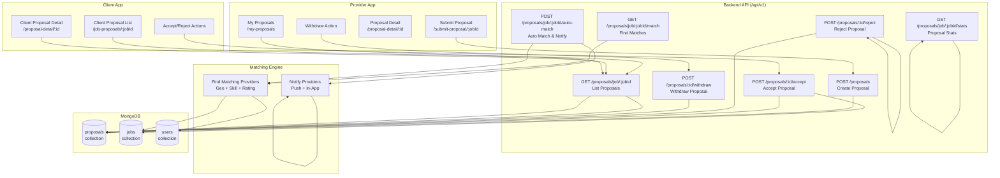
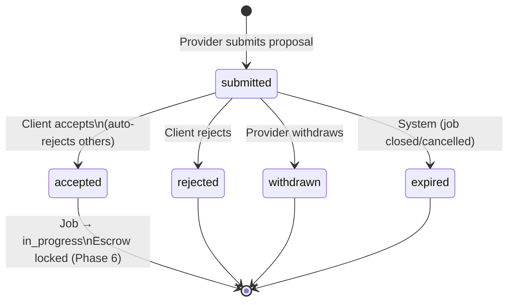
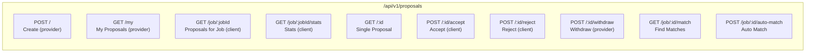
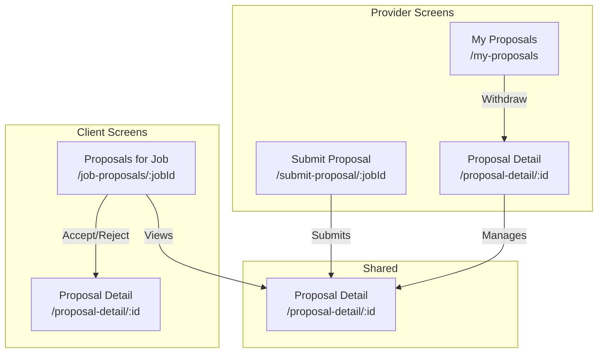
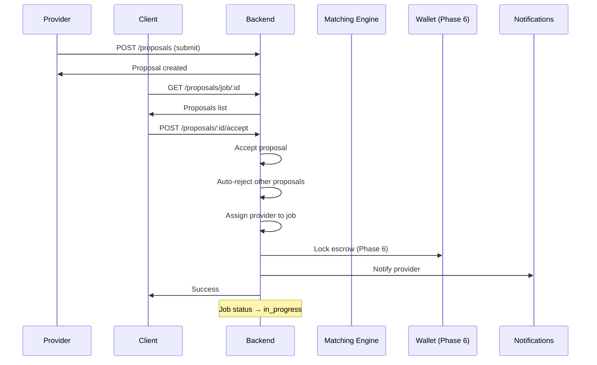

# Do It Platform - Phase 5: Proposals and Matching Engine

## Overview

Phase 5 implements the core proposal and matching functionality: providers submit proposals for jobs, clients review and accept/reject proposals, and the matching engine automatically finds and notifies suitable providers for new jobs. This phase bridges job creation (Phase 4) with escrow/payments (Phase 6).

**Duration**: 1 sprint
**Status**: ✅ Completed
**Completion Date**: 2026-08-11

---

## Architecture



---

## Proposal State Machine



### Permission Matrix

| Transition | Client (Job Owner) | Provider (Proposer) | Admin |
|------------|-------------------|---------------------|-------|
| submitted → accepted | ✅ | ❌ | ✅ |
| submitted → rejected | ✅ | ❌ | ✅ |
| submitted → withdrawn | ❌ | ✅ | ✅ |
| submitted → expired | ❌ | ❌ | ✅ (system) |

---

## Data Model

```mermaid
erDiagram
    PROPOSAL ||--o| JOB : "for"
    PROPOSAL }|--|| USER : "provider"
    PROPOSAL }|--|| USER : "client"
    PROPOSAL ||--o| DISPUTE : "may have"
    PROPOSAL ||--o| REVIEW : "may have"

    PROPOSAL {
        ObjectId _id PK
        ObjectId jobId FK
        ObjectId providerId FK
        ObjectId clientId FK
        int bidAmount "USD cents"
        enum bidType "fixed|hourly"
        int hourlyRate
        int estimatedHours
        string coverLetter
        string estimatedTimeline
        enum status "submitted|accepted|rejected|withdrawn|expired"
        datetime submittedAt
        datetime respondedAt
        datetime acceptedAt
        datetime rejectedAt
        datetime withdrawnAt
        object clientResponse {message, respondedBy}
        datetime createdAt
        datetime updatedAt
    }

    JOB ||--o{ PROPOSAL : "has"
    USER ||--o{ PROPOSAL : "submits (provider)"
    USER ||--o{ PROPOSAL : "owns (client)"
```

---

## API Endpoints



### Request/Response Examples

**Create Proposal (POST /proposals)**
```json
{
  "jobId": "job-id",
  "bidAmount": 50000,
  "bidType": "fixed",
  "coverLetter": "I have 10 years experience...",
  "estimatedTimeline": "2 weeks"
}
```

**Hourly Bid Variant**
```json
{
  "jobId": "job-id",
  "bidAmount": 5000,
  "bidType": "hourly",
  "hourlyRate": 5000,
  "estimatedHours": 20,
  "coverLetter": "Available immediately...",
  "estimatedTimeline": "1 week"
}
```

**Accept Proposal (POST /proposals/:id/accept)**
```json
{
  "action": "accept",
  "message": "Great experience match!"
}
```

---

## Matching Engine

```mermaid
flowchart TD
    A[Job Created / Auto-Match Triggered] --> B[Fetch Job Requirements]
    B --> C{Job Type?}
    C -->|Physical/Errand| D[Geo Query: $near + radius]
    C -->|Digital| E[Skill/Category Filter Only]
    D --> F[Filter: Verified Categories]
    E --> F
    F --> G[Filter: Rating >= 4.0]
    G --> H[Filter: Availability]
    H --> I[Calculate Skill Overlap]
    I --> J[Calculate Match Score]
    J --> K[Sort: Score DESC, Distance ASC]
    K --> L[Limit Results (default 10)]
    L --> M[Return Ranked Providers]
    M --> N[Auto-Notify (Optional)]
```

### Match Score Formula

```
MatchScore = (SkillOverlap × 40) + (Rating/5 × 25) + (CategoryMatch × 20) + (Availability × 15)

Where:
- SkillOverlap = matching_skills / required_skills (0-1)
- Rating = provider.rating / 5 (0-1)
- CategoryMatch = verified_matching_categories / required_categories (0-1)
- Availability = 1 if available, 0 otherwise
```

### Matching Options

| Parameter | Default | Description |
|-----------|---------|-------------|
| `limit` | 10 | Max providers to return |
| `minRating` | 4.0 | Minimum provider rating |
| `radiusKm` | 50 | Search radius (physical/errand) |

---

## Mobile Screens



### Screen Details

| Screen | Route | Purpose |
|--------|-------|---------|
| Submit Proposal | `/submit-proposal/:jobId` | Fixed/Hourly bid, cover letter, timeline |
| Client Proposal List | `/job-proposals/:jobId` | Tabbed view, accept/reject actions |
| Provider Proposal List | `/my-proposals` | Status tabs, withdraw action |
| Proposal Detail | `/proposal-detail/:id` | Full view, role-based actions |

---

## Integration Points



---

## Files Created/Modified

### Backend
```
backend/src/modules/proposals/
├── proposal.model.ts          # Proposal schema + state machine methods
├── proposal.validation.ts     # Joi schemas
├── proposal.service.ts        # Business logic
├── proposal.controller.ts     # 9 HTTP handlers
├── proposal.routes.ts         # 10 endpoints
├── matching.service.ts        # Matching engine
backend/src/routes/index.ts    # Mounted proposals router
```

### Mobile
```
mobile/src/services/proposalService.ts          # API client
mobile/app/(provider)/submit-proposal/[jobId].tsx
mobile/app/(client)/job-proposals/[jobId].tsx
mobile/app/(provider)/my-proposals.tsx
mobile/app/(shared)/proposal-detail/[proposalId].tsx
```

---

## Verification Checklist

| Component | Status |
|-----------|--------|
| Backend TypeScript | ✅ Clean |
| Backend Tests (12/12) | ✅ Pass |
| Mobile TypeScript | ✅ Clean |
| Proposal Model & Indexes | ✅ Created |
| Validation Schemas | ✅ Complete |
| Service Layer | ✅ Complete |
| Controller & Routes | ✅ Mounted |
| Matching Engine | ✅ Complete |
| Mobile Proposal Service | ✅ Typed |
| Proposal Submission | ✅ Complete |
| Client Proposal List | ✅ Complete |
| Provider Proposal List | ✅ Complete |
| Proposal Detail | ✅ Role-based actions |
| State Machine | ✅ Enforced |
| Matching Engine | ✅ Geo + Skill + Rating |

---

## Next Phase Dependencies

| Phase | Dependency |
|-------|------------|
| Phase 6: Wallet/Escrow | Requires proposal acceptance trigger for escrow lock |
| Phase 6: Payments | Requires escrow release on job completion |
| Phase 8: Disputes | Requires dispute tracking in Proposal model |
| Phase 9: Notifications | Requires proposal events (created, accepted, rejected) |

---

## Notes for Future Phases

1. **Escrow Integration (Phase 6)**: `acceptProposal` should trigger escrow lock; `completed` status should trigger release.

2. **Proposals/Applications (Phase 6+)**: Add `applications` collection for more complex flows (interviews, counter-offers).

3. **Matching Enhancement**: ML-based ranking, historical success rates, provider workload balancing.

4. **Admin Moderation**: Add endpoints for proposal moderation (flag inappropriate, remove spam).

5. **Search Enhancement**: Full-text search across proposals for clients.