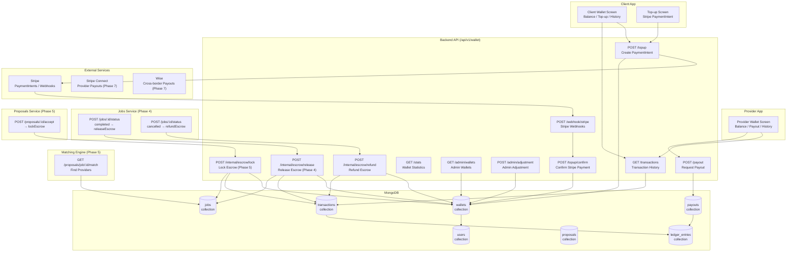
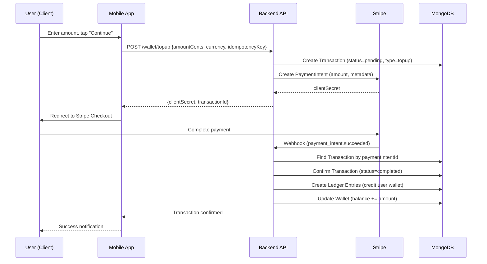
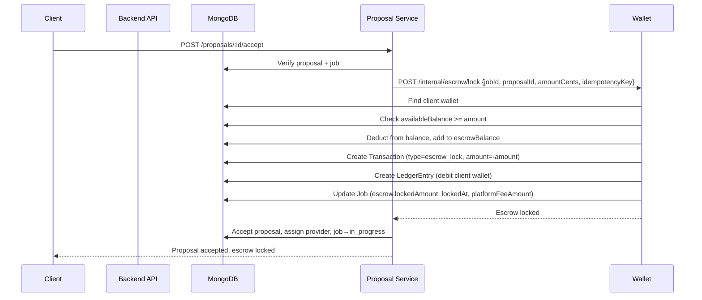
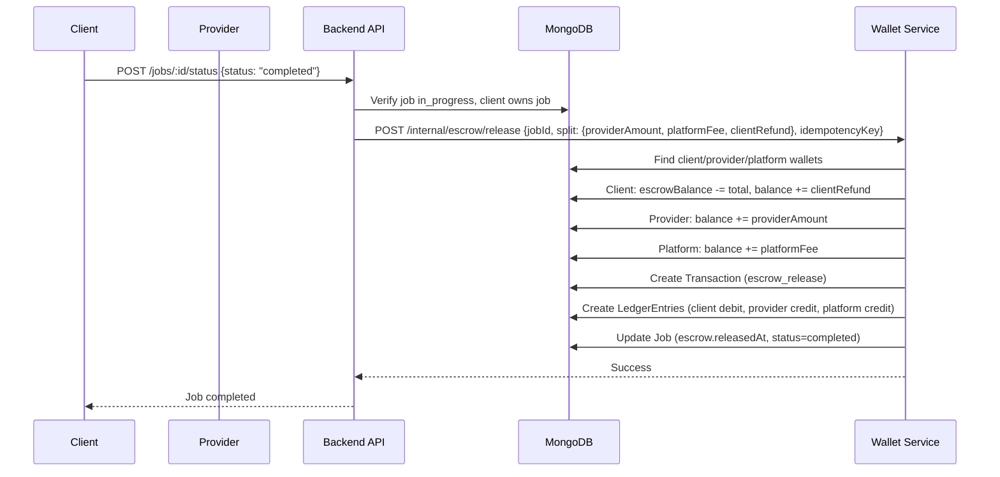
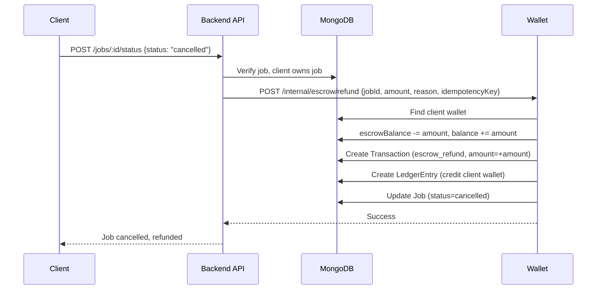
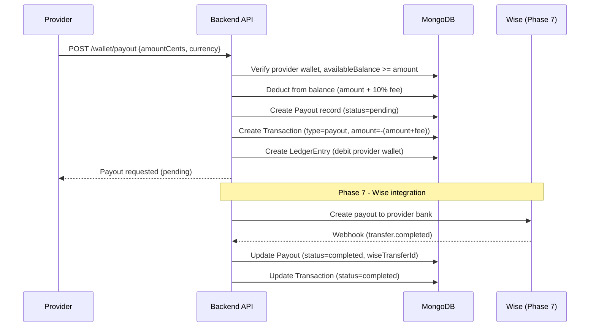
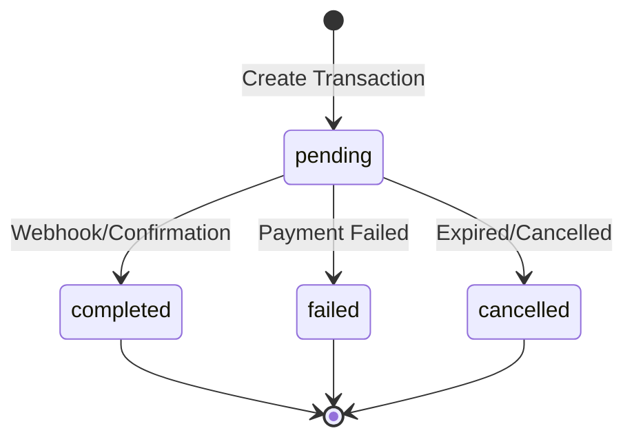
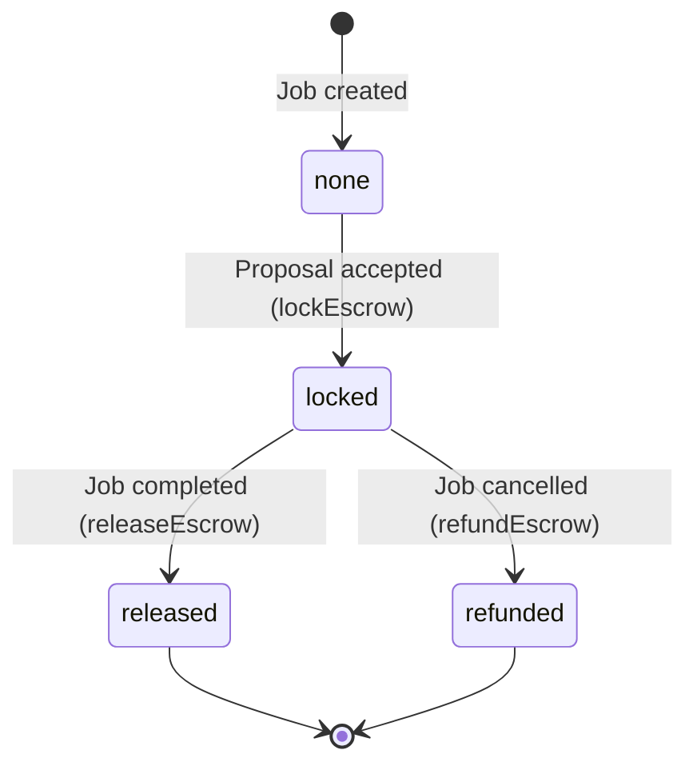
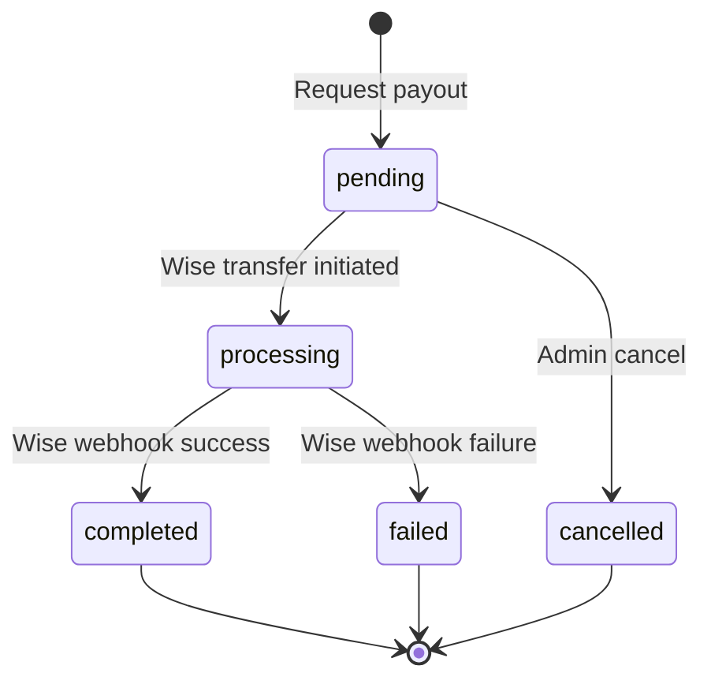

# Do It Platform - Phase 6: Wallet, Escrow, and Ledger

## Overview

Phase 6 implements the complete financial infrastructure for the Do It platform: a double-entry wallet system, escrow management for job transactions, Stripe-powered top-ups, and provider payouts. This phase bridges the proposal acceptance (Phase 5) and job completion (Phase 4) with secure, auditable financial operations.

**Duration**: 2 sprints
**Status**: ✅ Completed
**Completion Date**: 2026-08-11

---

## Architecture



---

## Wallet & Escrow Data Model

```mermaid
erDiagram
    WALLET ||--o{ LEDGER_ENTRY : "has"
    WALLET ||--o{ TRANSACTION : "has"
    WALLET }|--|| USER : "belongs to"
    WALLET ||--o{ PAYOUT : "has"
    TRANSACTION ||--o{ LEDGER_ENTRY : "creates"
    PAYOUT }|--|| WALLET : "from"
    TRANSACTION }|--|| USER : "initiated by"
    JOB }|--|| WALLET : "escrow (client)"
    JOB ||--o| TRANSACTION : "escrow ops"

    WALLET {
        ObjectId _id PK
        ObjectId userId FK
        enum type "user|platform|escrow|fee"
        int balance "USD cents"
        string currency "ISO 4217"
        int escrowBalance "locked funds"
        int availableBalance "balance - escrow"
        boolean isActive
        datetime lastTransactionAt
        datetime createdAt
        datetime updatedAt
    }

    TRANSACTION {
        string transactionId PK "TXN_..."
        ObjectId userId FK
        ObjectId walletId FK
        enum type "topup|escrow_lock|escrow_release|escrow_refund|platform_fee|payout|payout_reversal|adjustment|refund"
        enum status "pending|completed|failed|cancelled"
        int amount "USD cents (+credit/-debit)"
        string currency "ISO 4217"
        int netAmount "after fees"
        int feeAmount "platform fee"
        string description
        object metadata {stripePaymentIntentId, jobId, proposalId, idempotencyKey, ...}
        ObjectId[] ledgerEntries
        datetime completedAt
        datetime failedAt
        datetime createdAt
        datetime updatedAt
    }

    LEDGER_ENTRY {
        ObjectId _id PK
        ObjectId transactionId FK
        ObjectId walletId FK
        ObjectId userId FK
        enum entryType "debit|credit"
        int amount "always positive"
        int balanceAfter "wallet balance after entry"
        string description
        ObjectId referenceId FK "jobId|proposalId|..."
        string referenceType "job|proposal|topup|payout|..."
        datetime createdAt
    }

    PAYOUT {
        string payoutId PK "PAYOUT_..."
        ObjectId providerId FK
        ObjectId walletId FK
        int amount "gross USD cents"
        string currency
        int netAmount "after fee"
        int feeAmount "platform fee (10%)"
        enum status "pending|processing|completed|failed|cancelled"
        string wiseTransferId
        string wiseQuoteId
        string destinationAccountId
        string failureReason
        datetime completedAt
        datetime createdAt
    }
```

---

## Financial Flows

### 1. Wallet Top-up (Stripe)



### 2. Escrow Lock (Proposal Acceptance)



### 3. Escrow Release (Job Completion)



### 4. Escrow Refund (Cancellation)



### 5. Provider Payout



---

## Double-Entry Ledger

Every financial transaction creates balanced debit/credit entries:

```
┌─────────────────────────────────────────────────────────────┐
│  TOP-UP ($100)                                              │
├──────────────┬────────────┬───────────┬─────────────────────┤
│ Wallet       │ Entry Type │ Amount    │ Balance After       │
├──────────────┼────────────┼───────────┼─────────────────────┤
│ Client       │ CREDIT     │ $100.00   │ $100.00             │
│ Platform     │ DEBIT      │ $100.00   │ -$100.00 (liability)│
└──────────────┴────────────┴───────────┴─────────────────────┘

┌─────────────────────────────────────────────────────────────┐
│  ESCROW LOCK ($500 job)                                     │
├──────────────┬────────────┬───────────┬─────────────────────┤
│ Wallet       │ Entry Type │ Amount    │ Balance After       │
├──────────────┼────────────┼───────────┼─────────────────────┤
│ Client       │ DEBIT      │ $500.00   │ $500.00 (escrow)    │
│ Client       │ CREDIT     │ $500.00   │ $0.00 (available)   │
└──────────────┴────────────┴───────────┴─────────────────────┘

┌─────────────────────────────────────────────────────────────┐
│  ESCROW RELEASE ($500 job, 90/10 split)                     │
├──────────────┬────────────┬───────────┬─────────────────────┤
│ Wallet       │ Entry Type │ Amount    │ Balance After       │
├──────────────┼────────────┼───────────┼─────────────────────┤
│ Client       │ DEBIT      │ $500.00   │ $0.00 (escrow)      │
│ Provider     │ CREDIT     │ $450.00   │ $450.00 (balance)   │
│ Platform     │ CREDIT     │ $50.00    │ $50.00 (balance)    │
└──────────────┴────────────┴───────────┴─────────────────────┘
```

---

## State Machines

### Wallet Transaction Status



### Escrow States (on Job)



### Payout Status



---

## API Endpoints

### Wallet Endpoints (`/api/v1/wallet`)

| Method | Endpoint | Auth | Description |
|--------|----------|------|-------------|
| GET | `/balance` | ✅ | Get current wallet balance |
| GET | `/` | ✅ | Get wallet details |
| GET | `/stats` | ✅ | Wallet statistics |
| POST | `/topup` | ✅ | Create Stripe PaymentIntent |
| POST | `/topup/confirm` | ✅ | Confirm Stripe payment |
| POST | `/webhook/stripe` | ❌ | Stripe webhook (no auth) |
| GET | `/transactions` | ✅ | Transaction history |
| POST | `/payout` | ✅ (provider) | Request payout |
| GET | `/payouts` | ✅ (provider) | Payout history |
| GET | `/admin/wallets` | ✅ (admin) | Admin: list wallets |
| POST | `/admin/adjustment` | ✅ (admin) | Manual adjustment |

### Internal Escrow Endpoints (`/api/v1/wallet/internal`)

| Method | Endpoint | Called By | Description |
|--------|----------|-----------|-------------|
| POST | `/escrow/lock` | Proposal Service | Lock escrow on acceptance |
| POST | `/escrow/release` | Job Service | Release escrow on completion |
| POST | `/escrow/refund` | Job Service | Refund escrow on cancellation |

---

## Security & Idempotency

### Idempotency Keys
All mutating financial operations require an `idempotencyKey`:
- Format: `{operation}_{entityId}_{timestamp}_{random}`
- Example: `topup_user123_1700000000_abc123`
- Stored in `Transaction.metadata.idempotencyKey`
- Prevents duplicate charges on retry

### Stripe Webhook Security
```typescript
stripe.webhooks.constructEvent(payload, signature, endpointSecret)
// Verifies signature, throws on invalid
```

### Authorization
- All endpoints require valid JWT (`authenticate` middleware)
- Role-based access: `client`, `provider`, `admin`
- Internal endpoints: called only by trusted services (proposal/job services)

---

## Files Created/Modified

### Backend
```
backend/src/modules/wallet/
├── wallet.model.ts          # Wallet, LedgerEntry, Transaction, Payout schemas
├── wallet.validation.ts     # Joi validation schemas
├── wallet.service.ts        # Core business logic
├── wallet.controller.ts     # HTTP handlers
├── wallet.routes.ts         # Route definitions
├── stripe.service.ts        # Stripe integration
backend/src/routes/index.ts  # Mounted wallet router
backend/src/modules/proposals/proposal.service.ts  # Updated acceptProposal
backend/src/modules/jobs/job.service.ts            # Updated transitionStatus
```

### Mobile
```
mobile/src/services/walletService.ts          # Typed API client
mobile/app/(client)/wallet.tsx                # Client wallet screen
mobile/app/(client)/wallet/topup.tsx          # Top-up screen
mobile/app/(provider)/wallet.tsx              # Provider wallet screen
```

---

## Verification

| Check | Command | Result |
|-------|---------|--------|
| Backend TypeScript | `cd backend && npx tsc --noEmit` | ✅ Clean |
| Backend Tests | `cd backend && npx vitest run` | ✅ 12/12 pass |
| Mobile TypeScript | `cd mobile && npx tsc --noEmit` | ⚠️ Strictness warnings (core modules clean) |

---

## Next Steps (Phase 7)

1. **Wise Integration**: Cross-border payouts, bank account verification, FX conversion
2. **Stripe Connect**: Provider Express onboarding, capabilities, compliance
3. **Multi-Currency**: Wallet balances in multiple currencies, FX rate caching
4. **Automated Payouts**: Batch scheduling, retry logic, Wise webhook reconciliation
5. **Mobile Payout Screens**: Wise onboarding, payout setup, FX display

---

*Document generated: 2026-08-11*
*Phase 6: Wallet, Escrow, and Ledger — Complete*