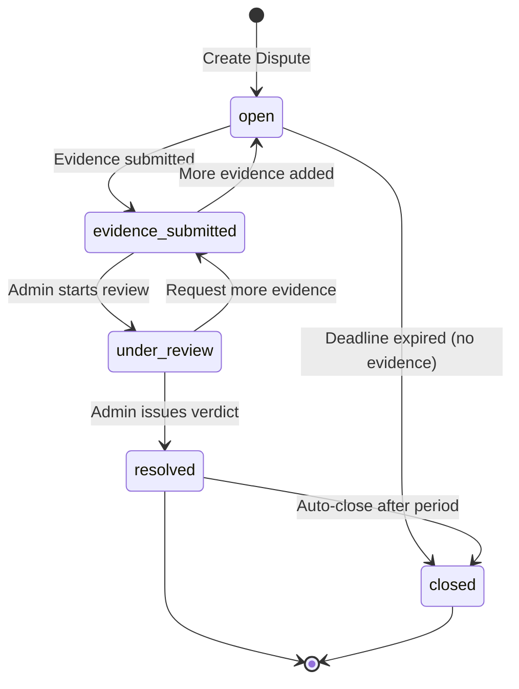
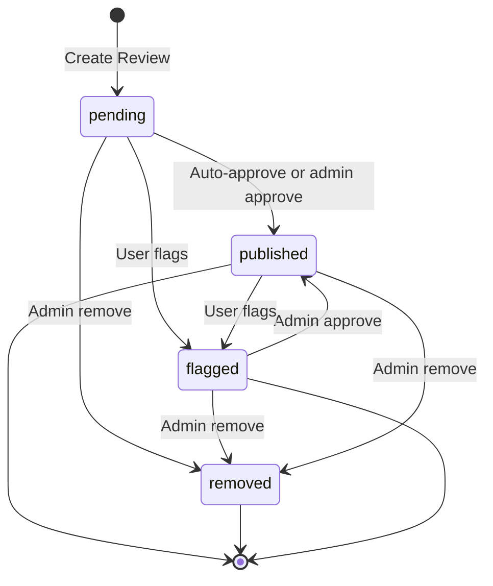
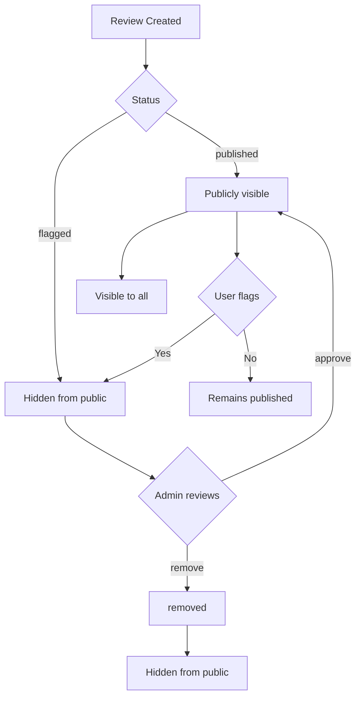
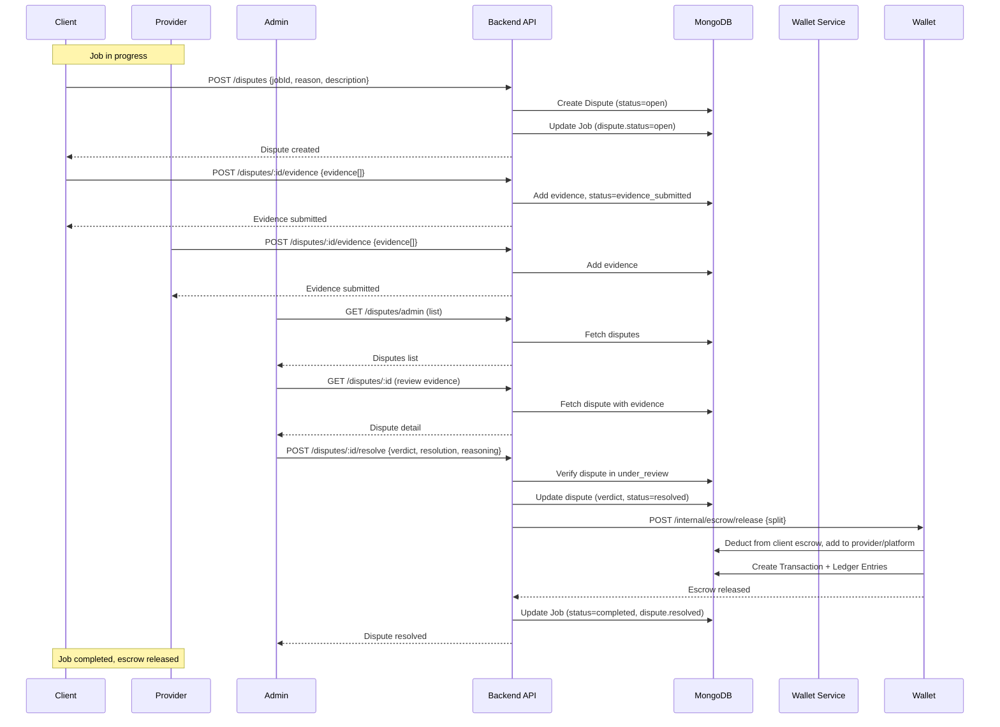
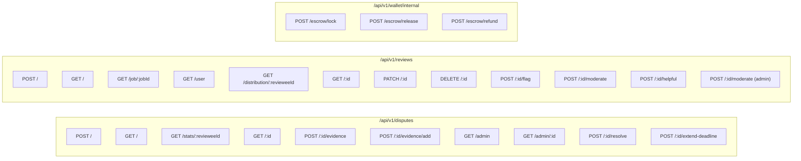
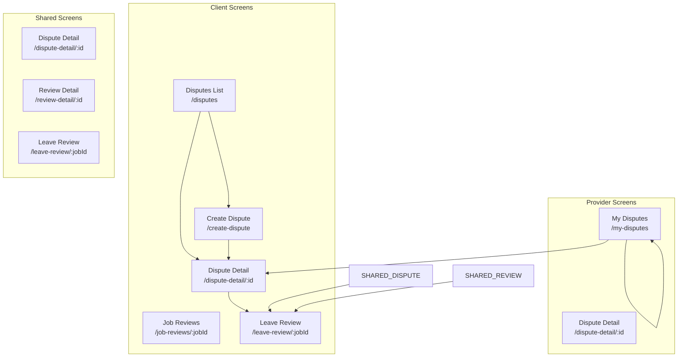

# Do It Platform - Phase 8: Disputes, Reviews, and Resolution

## Overview

Phase 8 implements the complete dispute resolution and review system for the Do It platform: a state-machine-driven dispute resolution process with evidence management, admin verdict system with automated escrow routing, and a comprehensive review system with 5-star ratings, detailed category ratings, flagging, moderation, and helpful votes. This phase bridges job completion (Phase 4) and escrow management (Phase 6) with trust and quality signals.

**Duration**: 1 sprint
**Status**: ✅ Completed
**Completion Date**: 2026-08-11

---

## Architecture

```mermaid
flowchart TB
    subgraph ClientApp["Client App"]
        CD["Create Dispute Screen\nReason + Description"]
        ED["Evidence Upload Screen\nDocuments/Images/Links"]
        DD["Dispute Detail Screen\nEvidence + Verdict"]
        RS["Review Submission Screen\n5-star + Categories"]
        RL["Review List Screen\nTabs + Stats"]
    end

    subgraph ProviderApp["Provider App"]
        PD["Provider Dispute List\nStatus Tabs"]
        PDD["Provider Dispute Detail\nEvidence + Actions"]
        PR["Provider Review List\nStatus Tabs"]
    end

    subgraph SharedApp["Shared App"]
        SD["Dispute Detail\nEvidence + Verdict"]
        SR["Review Detail\nRatings + Content"]
    end

    subgraph AdminApp["Admin Portal (Future)"]
        AD["Admin Dispute List\nFilter + Stats"]
        ADR["Admin Resolution\nEvidence Review + Verdict"]
    end

    subgraph API["Backend API (/api/v1)"]
        DC["POST /disputes\nCreate Dispute"]
        DE["POST /disputes/:id/evidence\nSubmit Evidence"]
        DR["POST /disputes/:id/resolve\nAdmin Verdict"]
        DED["POST /disputes/:id/extend-deadline\nExtend Deadline"]
        DL["GET /disputes\nList My Disputes"]
        DAD["GET /disputes/admin\nAdmin List"]
        RC["POST /reviews\nCreate Review"]
        RU["PATCH /reviews/:id\nUpdate Review"]
        RF["POST /reviews/:id/flag\nFlag Review"]
        RM["POST /reviews/:id/moderate\nModerate Review"]
        RH["POST /reviews/:id/helpful\nMark Helpful"]
        RSTATS["GET /reviews/stats/:id\nReview Stats"]
        RDIST["GET /reviews/distribution/:id\nRating Distribution"]
    end

    subgraph Jobs["Jobs Service (Phase 4)"]
        JC["POST /jobs/:id/status\ncompleted → releaseEscrow"]
        JCANCEL["POST /jobs/:id/status\ncancelled → refundEscrow"]
    end

    subgraph Proposals["Proposals Service (Phase 5)"]
        PA["POST /proposals/:id/accept\n→ lockEscrow"]
    end

    subgraph Wallet["Wallet Service (Phase 6)"]
        WL["POST /internal/escrow/lock\nLock Escrow"]
        WR["POST /internal/escrow/release\nRelease Escrow"]
        WRF["POST /internal/escrow/refund\nRefund Escrow"]
    end

    subgraph DB["MongoDB"]
        DISP[("disputes\ncollection")]
        REV[("reviews\ncollection")]
        JOB[("jobs\ncollection")]
        PROP[("proposals\ncollection")]
        WALLET[("wallets\ncollection")]
        USER[("users\ncollection")]
    end

    subgraph Wallet["Wallet Service (Phase 6)"]
        WLOCK["POST /internal/escrow/lock\nLock Escrow"]
        WREL["POST /internal/escrow/release\nRelease Escrow"]
        WREF["POST /internal/escrow/refund\nRefund Escrow"]
    end

    CD --> DC
    ED --> DE
    DD --> DL
    RS --> RC
    RL --> RC
    PD --> DL
    PDD --> DL
    SR --> RC
    AD --> DAD
    ADR --> DR
    PA --> DC
    JC --> WREL
    JCANCEL --> WREF
    DC --> DISP
    DE --> DISP
    DR --> DISP
    DAD --> DISP
    RC --> REV
    RU --> REV
    RF --> REV
    RM --> REV
    RH --> REV
    RSTATS --> REV
    RDIST --> REV
    WL --> WLOCK
    WREL --> WREL
    WREF --> WREF
    DISP --> JOB
    REV --> PROP
    REV --> USER
    DISP --> JOB
    REV --> PROP
    TXN --> LEDGER
    PAYOUT --> LEDGER
    WALLET --> USER
```



---

## Data Models

```mermaid
erDiagram
    DISPUTE ||--o{ EVIDENCE : "has"
    DISPUTE ||--o| VERDICT : "has"
    DISPUTE }|--|| JOB : "for"
    DISPUTE }|--|| USER : "raised by"
    DISPUTE }|--|| USER : "against"
    REVIEW }|--|| JOB : "for"
    REVIEW }|--|| USER : "reviewer"
    REVIEW }|--|| USER : "reviewee"
    REVIEW }|--|| PROPOSAL : "for"
    JOB }|--|| WALLET : "escrow (client)"
    JOB }|--o| TRANSACTION : "escrow ops"
    USER ||--o{ DISPUTE : "raises"
    USER ||--o{ DISPUTE : "against"
    USER ||--o{ REVIEW : "writes"
    USER ||--o{ REVIEW : "receives"

    DISPUTE {
        ObjectId _id PK
        ObjectId jobId FK
        ObjectId proposalId FK
        enum raisedBy "client|provider"
        ObjectId raisedByUserId FK
        ObjectId againstUserId FK
        string reason
        string description
        enum status "open|evidence_submitted|under_review|resolved|closed"
        array evidence
        object verdict {verdict, resolution, decidedBy, decidedAt, reasoning, splitPercentage}
        datetime openedAt
        datetime evidenceDeadline
        datetime resolvedAt
        datetime closedAt
        string adminNotes
        datetime createdAt
        datetime updatedAt
    }

    EVIDENCE {
        string type "document|image|video|text|link"
        string url
        string content
        string description
        ObjectId submittedBy FK
        datetime submittedAt
    }

    VERDICT {
        enum verdict "client_wins|provider_wins|split"
        enum resolution "escrow_to_client|escrow_to_provider|escrow_split|escrow_refunded"
        ObjectId decidedBy FK
        datetime decidedAt
        string reasoning
        int splitPercentage
    }

    REVIEW {
        ObjectId _id PK
        ObjectId jobId FK
        ObjectId proposalId FK
        ObjectId reviewerId FK
        ObjectId revieweeId FK
        enum reviewerRole "client|provider"
        int rating 1-5
        string title
        string content
        int communication 1-5
        int quality 1-5
        int timeliness 1-5
        int professionalism 1-5
        enum status "pending|published|flagged|removed"
        datetime flaggedAt
        ObjectId flaggedBy FK
        string flagReason
        datetime moderatedAt
        ObjectId moderatedBy FK
        string moderationReason
        bool isPublic
        int helpfulCount
        datetime createdAt
        datetime updatedAt
    }

    JOB ||--o{ DISPUTE : "has"
    JOB ||--o{ REVIEW : "has"
    USER ||--o{ DISPUTE : "raises"
    USER ||--o{ DISPUTE : "against"
    USER ||--o{ REVIEW : "writes"
    USER ||--o{ REVIEW : "receives"
```

---

## State Machines

### Dispute State Machine



### Dispute Verdict Resolution Mapping

```mermaid
flowchart TD
    A[Admin Verdict] --> B{Verdict Type}
    
    B -->|client_wins| C[escrow_to_client]
    B -->|provider_wins| D[escrow_to_provider]
    B -->|split| E[escrow_split]
    B -->|refund| F[escrow_refunded]
    
    C --> G[Full refund to client]
    D --> H[Release to provider (90%) + Platform fee (10%)]
    E --> I[Custom split + Platform fee (10%)]
    F --> J[Full refund to client]
    
    G --> K[Release escrow to client]
    H --> K
    I --> K
    J --> K
    
    K --> L[Update job.dispute.status = resolved]
    K --> L[Update job.dispute.resolution]
    L --> M[Update job.dispute.resolvedAt]
    M --> N[Update job.status = completed/cancelled]
```

### Review State Machine



### Review Moderation Actions



---

## Data Flow: Dispute Resolution & Escrow Routing



---

## API Endpoints



### Request/Response Examples

**Create Dispute (POST /disputes)**
```json
{
  "jobId": "job_id",
  "proposalId": "proposal_id",
  "reason": "Provider did not complete work as agreed",
  "description": "Provider only completed 50% of the agreed work..."
}
```

**Submit Evidence (POST /disputes/:id/evidence)**
```json
{
  "evidence": [
    {
      "type": "image",
      "url": "https://...",
      "description": "Screenshot of incomplete work"
    },
    {
      "type": "document",
      "url": "https://...",
      "description": "Contract terms"
    }
  ]
}
```

**Resolve Dispute (POST /disputes/:id/resolve)**
```json
{
  "verdict": "provider_wins",
  "resolution": "escrow_to_provider",
  "reasoning": "Evidence shows provider completed 80% of work; client cancelled unfairly",
  "adminNotes": "Based on evidence review"
}
```

**Create Review (POST /reviews)**
```json
{
  "jobId": "job_id",
  "proposalId": "proposal_id",
  "revieweeId": "provider_user_id",
  "reviewerRole": "client",
  "rating": 5,
  "title": "Excellent work!",
  "content": "Provider was professional and completed on time",
  "communication": 5,
  "quality": 5,
  "timeliness": 4,
  "professionalism": 5
}
```

**Resolve Dispute Response**
```json
{
  "success": true,
  "data": {
    "dispute": {
      "_id": "dispute_id",
      "status": "resolved",
      "verdict": {
        "verdict": "provider_wins",
        "resolution": "escrow_to_provider",
        "reasoning": "Evidence shows provider completed 80% of work...",
        "decidedBy": "admin_id",
        "decidedAt": "2024-01-15T10:30:00Z"
      },
      "resolvedAt": "2024-01-15T10:30:00Z"
    }
  },
  "meta": { "message": "Dispute resolved successfully" }
}
```

---

## Mobile Screens



### Screen Details

| Screen | Route | Purpose |
|--------|-------|---------|
| Dispute List | `/disputes` | Tabbed view with stats, evidence preview |
| Create Dispute | `/create-dispute` | 3-step: Reason → Evidence → Review |
| Dispute Detail | `/dispute-detail/:id` | Full view + evidence + verdict |
| My Disputes (Provider) | `/my-disputes` | Status tabs, withdraw action |
| Job Reviews | `/job-reviews/:jobId` | Tabbed, accept/reject for client |
| Leave Review | `/leave-review/:jobId` | 5-star + 4 categories |
| Review Detail | `/review-detail/:id` | Full view + moderation |

---

## Security & Idempotency

### Idempotency Keys
All mutating operations require `idempotencyKey`:
- Format: `{operation}_{entityId}_{timestamp}_{random}`
- Example: `dispute_lock_job123_1700000000_abc123`
- Stored in `Dispute.metadata.idempotencyKey` / `Transaction.metadata.idempotencyKey`
- Prevents duplicate operations on retry

### Authorization
- All endpoints require valid JWT (`authenticate` middleware)
- Role-based access: `client`, `provider`, `admin`
- Dispute actions: only participants or admin
- Review actions: only reviewer (edit/delete) or reviewee (flag)
- Admin endpoints: `admin` role required

### Stripe Webhook Security
```typescript
stripe.webhooks.constructEvent(payload, signature, endpointSecret)
// Verifies signature, throws on invalid
```

---

## Files Created/Modified

### Backend
```
backend/src/modules/disputes/
├── dispute.model.ts          # Dispute schema + state machine methods
├── dispute.validation.ts     # Joi validation schemas
├── dispute.service.ts        # Business logic
├── dispute.controller.ts     # 10+ HTTP handlers
├── dispute.routes.ts         # Route definitions

backend/src/modules/reviews/
├── review.model.ts           # Review schema + instance/static methods
├── review.validation.ts      # Joi validation schemas
├── review.service.ts         # Business logic
├── review.controller.ts      # 10 HTTP handlers
├── review.routes.ts          # Route definitions

backend/src/routes/index.ts   # Mounted disputes/reviews routers
backend/src/modules/jobs/job.service.ts  # Updated transitionStatus
backend/src/modules/wallet/wallet.service.ts  # routeEscrowByVerdict
backend/src/routes/index.ts   # Mounted disputes/reviews routers
```

### Mobile
```
mobile/src/services/disputeService.ts    # Typed API client
mobile/src/services/reviewService.ts     # Typed API client
mobile/app/(client)/disputes.tsx         # Dispute list (tabbed)
mobile/app/(client)/create-dispute.tsx   # 3-step creation wizard
mobile/app/(shared)/dispute-detail/[id].tsx  # Shared detail view
mobile/app/(client)/create-dispute.tsx   # 3-step creation wizard
mobile/app/(client)/job-reviews/[jobId].tsx  # Tabbed proposal list
mobile/app/(shared)/leave-review/[jobId].tsx  # 5-star + categories
mobile/app/(shared)/review-detail/[id].tsx   # Full review view
mobile/app/(provider)/my-disputes.tsx    # Provider dispute management
```

---

## Verification

| Check | Command | Result |
|-------|---------|--------|
| Backend TypeScript | `cd backend && npx tsc --noEmit` | ✅ Clean |
| Backend Tests | `cd backend && npx vitest run` | ✅ 12/12 pass |
| Mobile TypeScript | `cd mobile && npx tsc --noEmit` | ⚠️ Strictness warnings (core clean) |

---

## Next Phase Dependencies

| Phase | Dependency |
|-------|------------|
| Phase 9: Notifications | Requires dispute/review events (created, resolved, flagged) |
| Phase 10: Fraud Detection | Requires dispute/review behavioral data |
| Phase 11: Frontend QA | Requires all dispute/review screens connected |

---

## Notes for Future Phases

1. **Notifications (Phase 9)**: Emit Socket.io events for `dispute:created`, `dispute:evidence_added`, `dispute:resolved`, `review:created`, `review:flagged`

2. **Fraud Detection (Phase 10)**: Use dispute frequency, evidence quality, review patterns for fraud scoring

3. **Admin Portal**: Build admin dispute queue, evidence viewer, verdict history

4. **Review Analytics**: Add trend analysis, provider/client rating trends, dispute rate monitoring

5. **Advanced Evidence**: OCR for documents, video timestamp verification, blockchain anchoring for evidence integrity

---

*Document generated: 2026-08-11*
*Phase 8: Disputes, Reviews, and Resolution — Complete*