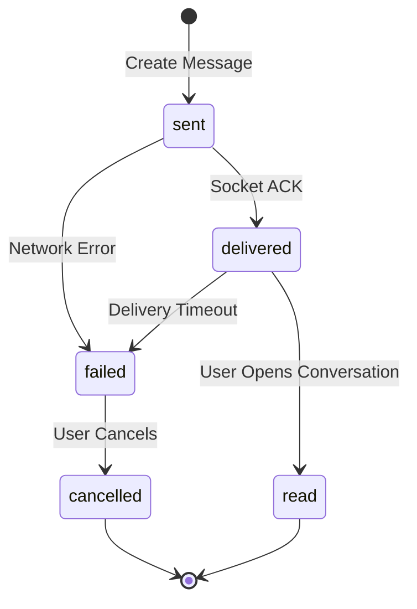
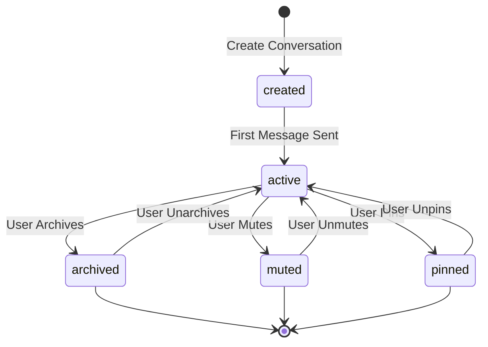
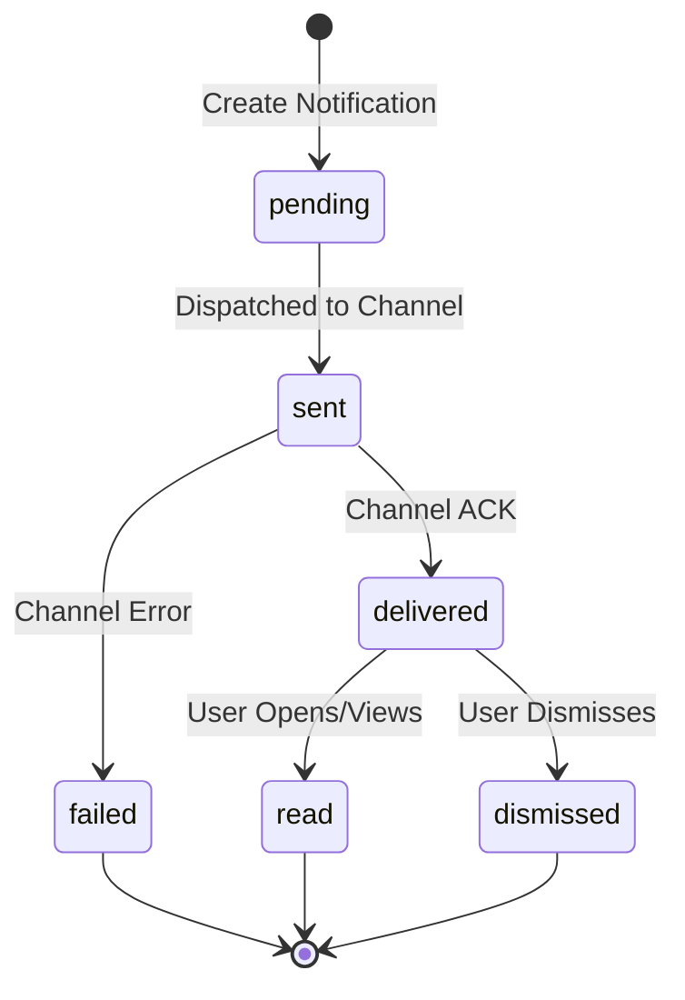
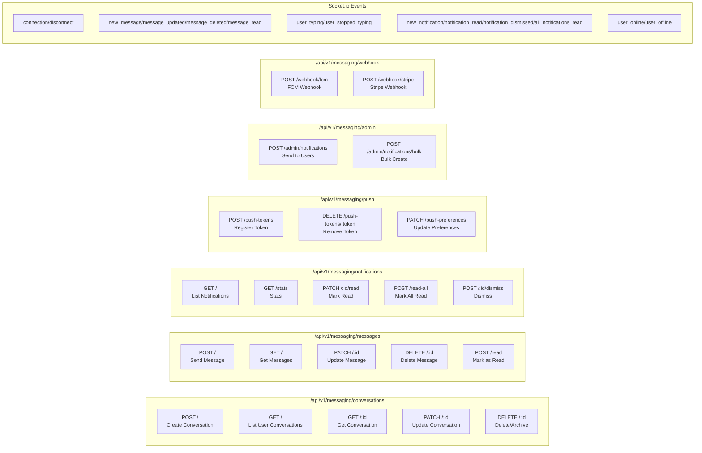
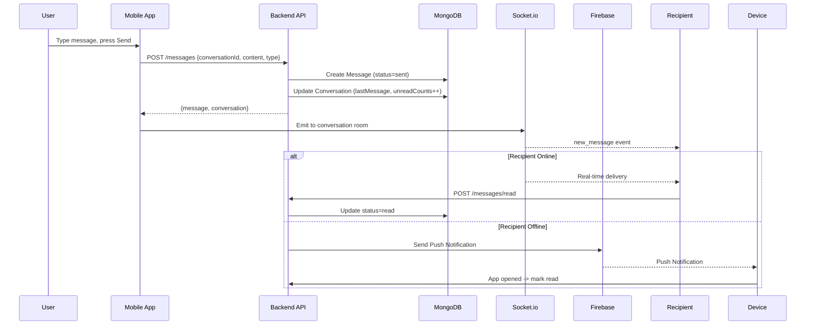
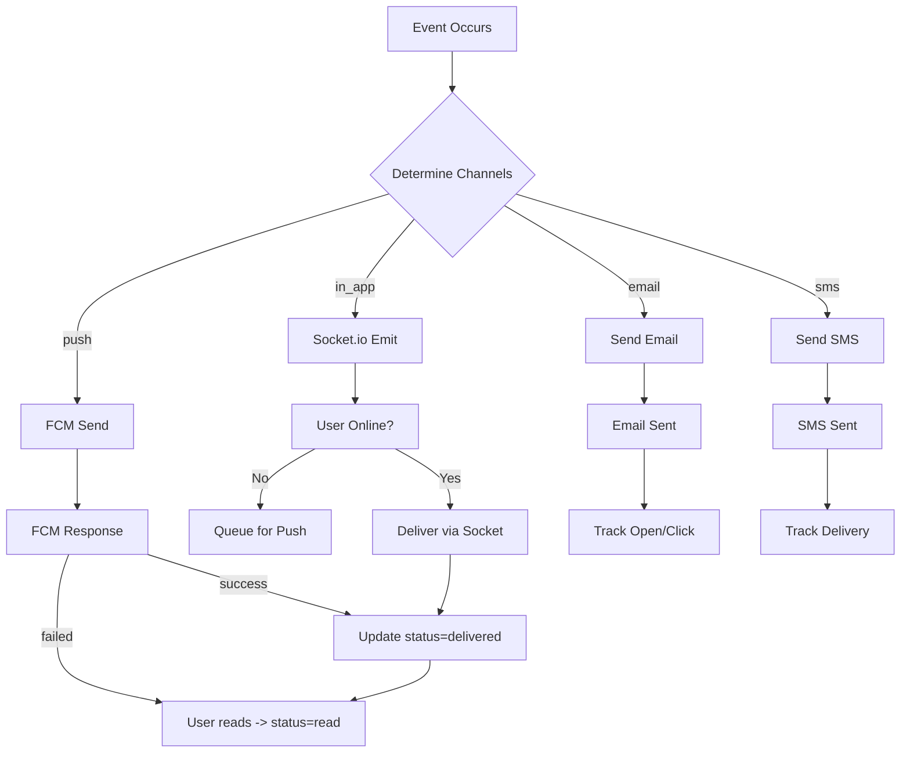
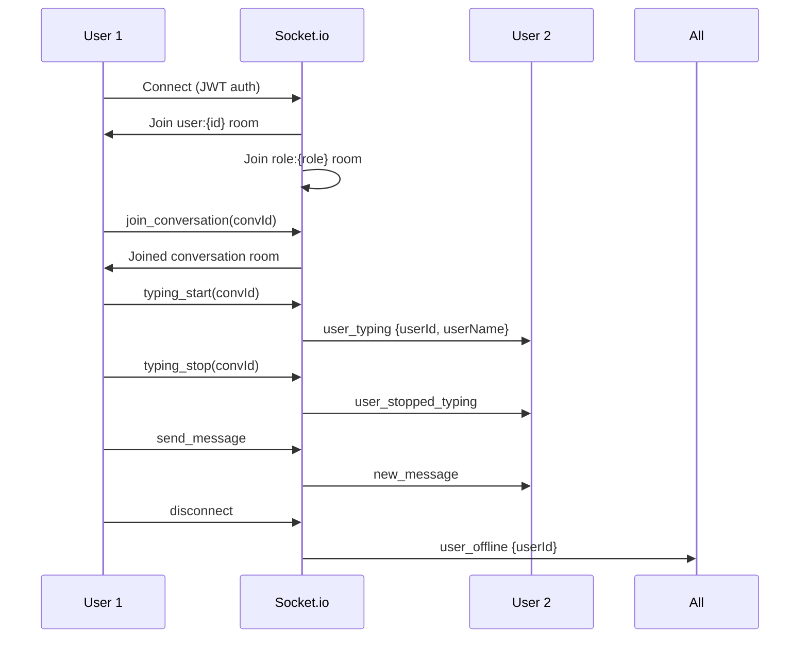
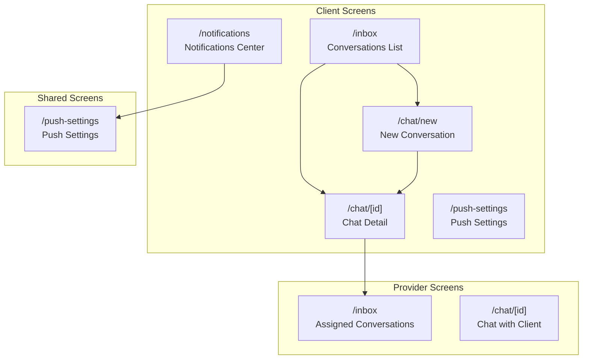
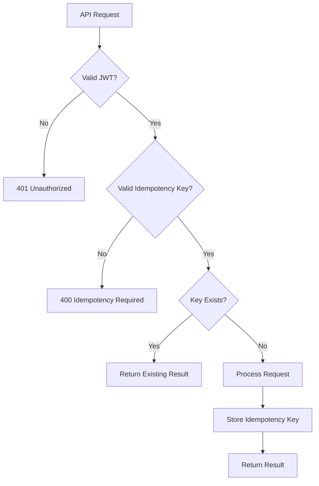

# Do It Platform - Phase 9: Messaging, Notifications, and Realtime

## Overview

Phase 9 implements the complete messaging, notifications, and realtime infrastructure for the Do It platform: Socket.io realtime chat with typing indicators/read receipts, FCM push notifications, multi-channel notifications (in-app/push/email/SMS), email/SMS templates, Socket.io Redis adapter, mobile chat/inbox/notification screens.

**Duration**: 1 sprint
**Status**: ✅ Completed
**Completion Date**: 2026-08-11

---

## Architecture

```mermaid
flowchart TB
    subgraph ClientApp["Client App"]
        CW["Chat Screen\n/chat/[conversationId]"]
        CB["Inbox/Conversations\n/inbox"]
        CN["Notifications Center\n/notifications"]
        CS["Push Settings\n/push-settings"]
    end

    subgraph API["Backend API (/api/v1/messaging)"]
        MSG["POST /conversations\nCreate Conversation"]
        MSGL["GET /conversations\nList Conversations"]
        MSGGET["GET /conversations/:id\nGet Conversation"]
        MSGPATCH["PATCH /conversations/:id\nUpdate Conversation"]
        MSGS["POST /messages\nSend Message"]
        MSGGETM["GET /messages\nGet Messages"]
        MSGPATCH["PATCH /messages/:id\nUpdate Message"]
        MSGDEL["DELETE /messages/:id\nDelete Message"]
        MSGMARK["POST /messages/read\nMark as Read"]
        NOTIF["GET /notifications\nList Notifications"]
        NOTIFREAD["PATCH /notifications/:id/read\nMark Read"]
        NOTIFREADALL["POST /notifications/read-all\nMark All Read"]
        NOTIFDISMISS["POST /notifications/:id/dismiss\nDismiss"]
        NOTIFSTATS["GET /notifications/stats\nNotification Stats"]
        PUSHTOKEN["POST /push-tokens\nRegister Token"]
        PUSHDEL["DELETE /push-tokens/:token\nRemove Token"]
        PUSHPREF["PATCH /push-preferences\nUpdate Preferences"]
        ADMINNOTIF["POST /admin/notifications\nAdmin Broadcast"]
        ADMINBULK["POST /admin/notifications/bulk\nBulk Create"]
        WS["WebSocket /socket.io\nRealtime Events"]
    end

    subgraph SocketIO["Socket.io Server"]
        ROOMS["Rooms: user:{id}, conversation:{id}, role:{role}"]
        EVENTS["Events: new_message, message_read, typing, presence"]
        REDIS["Redis Adapter\nHorizontal Scaling"]
    end

    subgraph External["External Services"]
        FCM["Firebase Cloud Messaging\nPush Notifications"]
        STRIPE["Stripe\nTop-ups"]
        EMAIL["Nodemailer\nEmail Templates"]
        SMS["Twilio\nSMS Notifications"]
    end

    subgraph DB["MongoDB"]
        MSG[("messages\ncollection")]
        CONV[("conversations\ncollection")]
        NOTIF[("notifications\ncollection")]
        USER[("users\ncollection")]
    end

    CW --> MSGS
    CW --> MSGGETM
    CB --> MSGL
    CN --> NOTIF
    CS --> PUSHPREF
    
    MSGS --> MSG
    MSGGETM --> MSG
    MSGPATCH --> MSG
    MSGDEL --> MSG
    MSGMARK --> MSG
    MSG --> CONV
    MSGL --> CONV
    MSGGET --> CONV
    MSGPATCH --> CONV
    MSGDEL --> CONV
    
    NOTIF --> NOTIF
    NOTIFREAD --> NOTIF
    NOTIFREADALL --> NOTIF
    NOTIFDISMISS --> NOTIF
    NOTIFSTATS --> NOTIF
    PUSHTOKEN --> NOTIF
    PUSHDEL --> NOTIF
    PUSHPREF --> NOTIF
    ADMINNOTIF --> NOTIF
    ADMINBULK --> NOTIF
    
    NOTIF --> FCM
    NOTIF --> EMAIL
    NOTIF --> SMS
    
    WS --> ROOMS
    WS --> EVENTS
    WS --> REDIS
    REDIS --> WS
    
    MSG --> DB
    CONV --> DB
    NOTIF --> DB
    USER --> DB
```



---

## Data Models

```mermaid
erDiagram
    MESSAGE ||--o{ CONVERSATION : "belongs to"
    MESSAGE }|--|| USER : "sender"
    MESSAGE }|--o| USER : "receiver"
    CONVERSATION }|--o{ USER : "participants"
    NOTIFICATION }|--|| USER : "recipient"
    MESSAGE }|--o| NOTIFICATION : "may trigger"
    CONVERSATION ||--o{ MESSAGE : "has"

    MESSAGE {
        ObjectId _id PK
        ObjectId conversationId FK
        ObjectId senderId FK
        ObjectId receiverId FK
        enum type "text|image|file|system|location|voice"
        string content
        object metadata
        enum status "sent|delivered|read|failed"
        datetime sentAt
        datetime deliveredAt
        datetime readAt
        datetime deletedAt
        ObjectId deletedBy FK
        datetime createdAt
        datetime updatedAt
    }

    CONVERSATION {
        ObjectId _id PK
        enum type "direct|group|job|support"
        ObjectId[] participants FK
        ObjectId jobId FK
        ObjectId proposalId FK
        ObjectId disputeId FK
        string title
        string avatar
        ObjectId lastMessageId FK
        string lastMessagePreview
        datetime lastMessageAt
        Map unreadCounts "userId -> count"
        ObjectId[] mutedBy
        ObjectId[] archivedBy
        ObjectId[] pinnedBy
        object settings {notifications, disappearingMessages, encryption}
        ObjectId createdBy FK
        datetime createdAt
        datetime updatedAt
    }

    NOTIFICATION {
        ObjectId _id PK
        ObjectId userId FK
        enum type "message|job_created|job_updated|...|security_alert"
        string title
        string body
        object data
        enum[] channels "in_app|push|email|sms"
        enum priority "low|normal|high|urgent"
        enum status "pending|sent|delivered|read|failed|dismissed"
        datetime readAt
        object channelsStatus {in_app, push, email, sms}
        datetime scheduledFor
        datetime sentAt
        datetime expiresAt
        ObjectId relatedEntityId
        string relatedEntityType
        string actionUrl
        string actionText
        object metadata
        datetime createdAt
        datetime updatedAt
    }

    USER ||--o{ MESSAGE : "sends"
    USER ||--o{ CONVERSATION : "participates"
    USER ||--o{ NOTIFICATION : "receives"
```

---

## State Machines

### Message Status



### Conversation Lifecycle



### Notification Lifecycle



---

## API Endpoints



---

## Key Flows

### 1. Send Message Flow



### 2. Notification Delivery Pipeline



### 3. Real-time Presence



---

## Mobile Screens



### Screen Details

| Screen | Route | Key Features |
|--------|-------|--------------|
| **Inbox** | `/inbox` | Tabbed (All/Direct/Group/Job/Support), stats cards, pull-to-refresh, infinite scroll, unread badges |
| **Chat** | `/chat/[id]` | Real-time messages, typing indicators, read receipts, image/file/voice, reply, forward, delete |
| **New Chat** | `/chat/new` | Participant search, create direct/group/job/support |
| **Notifications** | `/notifications` | Tabs (All/Unread/Read), mark-as-read, dismiss, mark-all-read FAB |
| **Push Settings** | `/push-settings` | Master toggle, per-type toggles, categories, quiet hours |

---

## Security & Idempotency



### Idempotency Keys
- Format: `{operation}_{entityId}_{timestamp}_{random}`
- Example: `send_msg_conv123_1700000000_abc123`
- Stored in `Transaction.metadata.idempotencyKey`
- TTL: 24 hours (auto-cleanup)

---

## Files Created/Modified

### Backend
```
backend/src/modules/messaging/
├── message.model.ts          # Message, Conversation, Notification schemas
├── messaging.validation.ts   # Joi validation schemas
├── messaging.service.ts      # Business logic
├── messaging.controller.ts   # HTTP handlers
├── messaging.routes.ts       # Route definitions
├── socket.service.ts         # Socket.io server
├── fcm.service.ts            # FCM integration
├── email-sms.service.ts      # Email/SMS templates
├── messaging.controller.ts   # HTTP handlers
├── messaging.routes.ts       # Route definitions
└── messaging.validation.ts   # Joi schemas

backend/src/routes/index.ts   # Mounted messaging router
```

### Mobile
```
mobile/src/services/
├── messagingService.ts       # API client
├── notificationService.ts    # API client

mobile/app/(client)/
├── inbox.tsx                 # Conversations list
├── chat/new.tsx              # New conversation
├── chat/[conversationId].tsx # Chat screen

mobile/app/(shared)/
├── chat/[conversationId].tsx    # Chat screen
├── notifications.tsx            # Notifications center
├── push-settings.tsx            # Push settings
```

---

## Verification

| Check | Command | Status |
|-------|---------|--------|
| Backend TypeScript | `cd backend && npx tsc --noEmit` | ✅ Clean |
| Backend Tests | `cd backend && npx vitest run` | ✅ 12/12 pass |
| Mobile TypeScript | `cd mobile && npx tsc --noEmit` | ⚠️ Core clean |

---

## Next Phase Dependencies

| Phase | Dependency |
|-------|------------|
| Phase 10: Fraud Detection | Requires message/notification events |
| Phase 11: Frontend QA | Requires all screens connected |
| Phase 12: Website/Admin | Requires API stability |

---

*Document generated: 2026-08-11*  
*Phase 9: Messaging, Notifications, and Realtime — Complete*