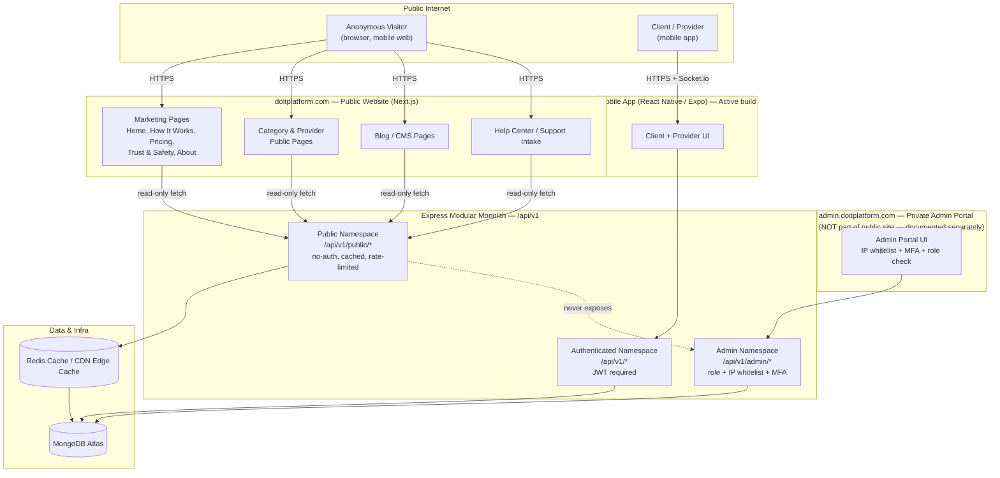

# Do It Platform — Public Website Documentation
### Frontend + Backend Specification (Public-Facing Web, Next.js)

Version: 1.0
Status: Draft for approval — extends existing Do It architecture (mobile app + backend already in build; admin portal documented separately)
Scope: This document covers **only the public website** (`doitplatform.com`) — what visitors, clients, and providers see and do on the web, and the backend that powers it. It does **not** re-document the private admin portal (already covered in your existing admin documentation) beyond describing where it lives and how it's isolated.

---

## 0. How This Fits the Existing System

Per the master architecture, the backend is a single Node.js + Express modular monolith (`/api/v1`) shared by three frontends:

| Frontend | Status | Audience |
|---|---|---|
| Mobile App (React Native/Expo) | Active build | Clients + Providers |
| **Public Website (Next.js)** | **This document** | Public visitors, prospective clients/providers, existing users on desktop/mobile web |
| Admin Portal (Next.js) | Documented separately | Internal ops/admin staff only |

**Rule carried over from the master docs:** the website is a *separate frontend codebase* that consumes the *same backend APIs* as the mobile app. No business logic lives in the website — only presentation, SEO, and content. Anything that touches money, escrow, KYC decisions, or fraud stays entirely in the backend service layer, identical to the mobile app's behavior.

---

## 1. Public Website — Site Map

```
doitplatform.com/
├── /                          Home
├── /how-it-works              For Clients / For Providers (toggle)
├── /categories                All service categories
├── /categories/[slug]         Single category landing page
├── /providers/[username]      Public provider profile (SEO-indexable)
├── /pricing                   Fees & how payments work
├── /trust-and-safety           Verification, escrow, fraud protection explainer
├── /blog                       Articles (CMS-driven)
├── /blog/[slug]                Single article
├── /about                      Company story, mission
├── /help                       Help Center home
├── /help/faq                   FAQ list
├── /help/faq/[slug]             FAQ article
├── /help/contact                Contact form
├── /help/report                 Report a safety issue (public-facing intake)
├── /download                    App Store / Google Play links
├── /legal/privacy-policy
├── /legal/terms-of-service
├── /legal/cookie-policy
├── /login                       Redirects to app deep link OR lightweight web login (see §5)
├── /register                    Redirects to app deep link OR lightweight web signup (see §5)
└── /admin/*                     Private admin portal — NOT part of the public site
                                  (separate app, IP-whitelisted, MFA, not linked
                                   from any public page, not in sitemap.xml or robots.txt)
```

**Admin isolation note (private path):** the admin portal is deployed as a distinct Next.js app/route group behind a private subdomain (e.g. `admin.doitplatform.com`), never `doitplatform.com/admin`. It is excluded from `sitemap.xml`, disallowed in `robots.txt`, has no public links pointing to it, sits behind IP allow-listing at the edge (Cloudflare) in addition to the app-level role + MFA check, and is documented separately per your existing admin documentation.

### 1.1 High-Level Architecture — Where the Public Website Sits



**Key takeaway from this diagram:** the public website only ever talks to the `public` namespace of the backend — it has no code path, credential, or link into the admin namespace or admin UI. The admin portal is a completely separate deployment, consuming its own hardened namespace. This is the enforced isolation referenced throughout §10.

---

## 2. What the Public (Logged-Out Visitor) Can See

This is the core question for the marketing/public layer — a visitor with no account should be able to:

| Capability | Page | Notes |
|---|---|---|
| Understand what Do It is | Home | Hero, value props, how it works summary |
| See how the platform works for each role | How It Works | Two tracks: Client journey, Provider journey |
| Browse service categories | Categories | Full category tree, icons, short descriptions |
| See category-level trust signals | Category detail | # of verified providers, average rating, starting price range |
| View a provider's **public** profile | Provider profile | Name, photo, bio, verified badges, rating, review count, portfolio, categories/skills — **never** phone/email/exact location/wallet data |
| Read reviews | Provider profile | Public reviews only (`is_visible = true`, not fraud-flagged) |
| Understand fees | Pricing | Platform fee ranges, how escrow works, currency conversion explainer |
| Understand safety | Trust & Safety | KYC explainer, escrow explainer, dispute process explainer (no internal fraud-rule detail) |
| Read editorial content | Blog | Tips, platform updates, category spotlights |
| Get help | Help Center | FAQ, contact form, safety reporting |
| Download the app | Download page | Store badges, QR code |
| Read legal docs | Legal pages | Privacy, ToS, cookies |

**What the public must never see**, even on a provider's public profile page: raw KYC documents, phone/email, exact GPS coordinates (city/region-level only), wallet balances, dispute history, internal fraud scores, or admin-only fields. This mirrors the "role-based views" principle already established in your provider-verification docs — the public website is the strictest tier, stricter even than the authenticated mobile app.

---

## 3. Public Website Content Model (What Data the Frontend Needs)

The website is presentation-only, but it still needs real data from the backend (or a CMS layer) to render. Below is what each page needs, shaped for public consumption via dedicated **public response mappers** (never raw internal schemas).

### 3.1 Home Page

| Data needed | Source | Shape (example) |
|---|---|---|
| Hero stats | `GET /api/v1/public/stats` | `{ total_providers, total_jobs_completed, countries_active, avg_rating }` |
| Featured categories | `GET /api/v1/public/categories?featured=true` | array of `{ name, slug, icon_url, provider_count }` |
| How-it-works summary steps | Static content / CMS | 3–4 step cards, client + provider variants |
| Testimonials | `GET /api/v1/public/testimonials` | `{ quote, author_first_name, role, rating }` (no full name/photo unless consented) |
| App download CTA | Static | Store links + QR |

### 3.2 Categories & Category Detail

| Data needed | Source | Shape |
|---|---|---|
| Category list | `GET /api/v1/public/categories` | `{ _id, slug, name (i18n), icon_url, job_type, subcategory_count }` |
| Category detail | `GET /api/v1/public/categories/:slug` | `{ name, description, verified_provider_count, avg_rating, starting_price_range, sample_providers[] }` |
| Sample verified providers | `GET /api/v1/public/categories/:slug/providers?limit=6` | Public provider cards (see §3.3) |

### 3.3 Public Provider Profile

| Field | Included publicly? | Notes |
|---|---|---|
| `full_name` | Yes | |
| `profile_photo_url` | Yes | |
| `headline`, `bio` | Yes | From Provider onboarding module |
| `categories[]`, `skill_items[]` | Yes — only **verified** ones | Unverified skills never shown publicly |
| `rating`, `review_count` | Yes | |
| `portfolio[]` | Yes, if `public_profile = true` | |
| `verified_badge` | Yes | Derived from `overall_status == verified` |
| `service_area` | City/region only | Never exact coordinates |
| `phone`, `email` | **No** | Contact only happens after job engagement in-app |
| `kyc_status` detail | **No** | Only a generic "Identity Verified" badge, no raw status |
| Reviews | Yes | Only `is_visible = true` and not `fraud_flagged` |

Endpoint: `GET /api/v1/public/providers/:username` — returns the mapped object above. `username` is a new public-safe slug field (not the Mongo `_id`), generated at profile-completion time.

### 3.4 Trust & Safety Page

Explains, in plain language (no implementation detail exposed):
- KYC verification (identity documents reviewed by a trained team)
- Skill verification (certificates, portfolios, tests, admin review)
- Escrow (payment held safely until work is confirmed complete)
- Dispute resolution (evidence window, admin review, fair verdict)
- Fraud protection (automated monitoring — described at a high level only, never rule specifics, consistent with never exposing fraud-detection mechanics publicly)

### 3.5 Blog / CMS

New collection needed: `blog_posts`
```
{
  _id, slug, title, excerpt, body_html_or_markdown,
  cover_image_url, author_name, tags[], category,
  published: boolean, published_at, seo: { meta_title, meta_description },
  created_at, updated_at
}
```
Authored via the admin portal (already documented), consumed read-only by the public website via `GET /api/v1/public/blog` and `GET /api/v1/public/blog/:slug`.

### 3.6 Help Center / FAQ

New collection: `faq_articles`
```
{ _id, slug, question, answer_html, category, sort_order, is_published, helpful_count, created_at, updated_at }
```
Public endpoints: `GET /api/v1/public/help/faq`, `GET /api/v1/public/help/faq/:slug`.

---

## 4. Help & Custom Support — Public-Facing Options

The website's support layer should give a logged-out visitor a full path to get help without needing the app, while routing anything account-specific back to authenticated channels.

| Option | Available to | Flow |
|---|---|---|
| **FAQ search** | Everyone | Static/CMS content, instant, no auth |
| **Contact form** | Everyone | `name, email, subject, message, category (general/billing/partnership/press)` → creates a `support_tickets` record, emailed to support queue |
| **Live chat widget** | Everyone (pre-chat form for logged-out visitors) | Same `live-chat` pattern already defined for the app; web widget hits the same `messaging` module via a public/guest channel |
| **Report a safety issue** | Everyone (no login required) | Lightweight version of the app's `report.tsx` flow — captures job ID/username if known, description, evidence upload (signed URL), routes directly to Trust & Safety admin queue with elevated priority |
| **My Tickets** | Logged-in only | Redirects to app or authenticated web session (§5) to view ticket thread |
| **Download the app for full support** | Everyone | CTA on every help page, since ticket history, live chat history, and dispute tools are richest in-app |

**Backend additions needed:**
```
POST /api/v1/public/support/contact          public contact form submission
POST /api/v1/public/support/report            public safety report (no auth)
GET  /api/v1/public/help/faq
GET  /api/v1/public/help/faq/:slug
```
All public support submissions land in the same `support_tickets` / `fraud_flags`-adjacent queues the admin portal already reviews — no new admin workflow required, just a new public-facing intake point.

---

## 5. Authenticated Web Sessions (Login/Register on Web)

Recommendation: keep the public website **primarily a marketing + trust layer**, and keep transactional actions (posting jobs, accepting proposals, wallet actions) on the mobile app for the current phase — consistent with the "mobile app first, website deferred to final stage" principle already set in your roadmap.

For `/login` and `/register` on web, two options to decide between:

| Option | Description | Recommended when |
|---|---|---|
| A — Deep link only | Web login/register pages just prompt "Continue in the app" with store badges + QR | Simplest, matches current phase-gating (Phase 12 is website/admin only) |
| B — Lightweight authenticated web view | Real login using the same `/api/v1/auth/login`, showing a read-only dashboard (profile, job history, wallet balance — no new transactions) | If you want web parity sooner |

Given your roadmap already defers full website/admin to Phase 12, **Option A is the recommended default for now**, with Option B as a Phase 12+ enhancement once the backend response mappers for web are built out.

---

## 6. Platform Story — What the Website Must Explain to Each Role

This is the "How It Works" page content, written for the public, plain-language, no internal jargon — but accurate to the real backend behavior.

### 6.1 For Clients

1. **Sign up** — register, verify email + phone.
2. **Post a job** — title, category, description, physical (with location + radius) or digital (remote), budget (fixed or hourly), deadline, up to 5 attachments.
3. **Get matched** — nearby or skill-matched verified providers are notified automatically; the client doesn't have to search manually, but can also browse providers directly.
4. **Review proposals** — each proposal shows the provider's bid, estimated time, rating, and a cover message; the client accepts exactly one.
5. **Escrow funds the job** — once a proposal is accepted, the client's wallet funds are locked in escrow automatically — the provider isn't paid until the client confirms.
6. **Track progress & chat** — in-app messaging with the accepted provider.
7. **Confirm completion** — when the provider marks the job done, the client reviews and confirms; funds release (minus platform fee).
8. **Leave a review** — rate the provider; if something's wrong, raise a dispute instead within the evidence window.
9. **Dispute (if needed)** — evidence window opens, admin reviews both sides, and issues a verdict; escrow is refunded or released accordingly.

### 6.2 For Providers

1. **Sign up** — register as a provider, verify email + phone.
2. **Identity verification (KYC)** — submit ID + selfie + proof of address; reviewed by the trust & safety team, typically within 48 hours.
3. **Choose categories & skills** — select up to 3 categories and the specific skill items within them (physical trades or digital skills).
4. **Verify your skills** — submit evidence per category:
   - *Physical:* certificate/license upload, prior work photos, or (where offered) an in-person practical test.
   - *Digital:* certificate upload, portfolio link, connected platform account (e.g. GitHub), or an in-app skill test.
   - Some evidence auto-verifies instantly (e.g. valid credential links, skill test scores above threshold); others go to admin review, typically 24–48 hours.
5. **Build your profile** — bio, years of experience, work history, portfolio, availability calendar. A resume can be uploaded to auto-fill this.
6. **Browse or get matched to jobs** — physical jobs are matched by location + category; digital jobs by skill match, worldwide.
7. **Submit a proposal** — bid amount, estimated completion time, and a short cover message per job (max 10 active proposals at a time to keep things fair).
8. **Get accepted & work** — once a client accepts, the job locks and escrow funds it; other proposals are automatically declined.
9. **Mark the job complete** — once finished, mark it done; once the client confirms, funds release to your wallet (platform fee deducted).
10. **Get paid out** — request a withdrawal; converted to your local currency and sent to your bank or mobile wallet.
11. **Build your reputation** — verified badges and ratings compound over time, increasing visibility in future matching.

**A provider is only visible in matching and public search for a given category once both identity KYC is approved AND that specific category's skill verification is approved** — this dual-gate rule should be stated plainly on the "For Providers" page since it's the #1 source of onboarding confusion.

---

## 7. Public Website — Backend Requirements Summary

### 7.1 New/Extended Collections (website-specific, additive — no changes to existing app collections)

| Collection | Purpose |
|---|---|
| `blog_posts` | CMS-authored articles |
| `faq_articles` | Help Center content |
| `testimonials` | Curated public testimonials (admin-approved subset of reviews, or separately submitted) |
| `support_tickets` | Public contact form + safety reports (shared queue with existing help/support system) |
| `public_stats_cache` | Precomputed/cached homepage stats (refreshed on a schedule via Bull, not computed live per request) |

### 7.2 Public API Namespace

All public website endpoints live under a dedicated, **read-mostly, no-auth-required** namespace to keep it clearly separated from authenticated app APIs and to make caching/rate-limiting simpler:

```
GET  /api/v1/public/stats
GET  /api/v1/public/categories
GET  /api/v1/public/categories/:slug
GET  /api/v1/public/categories/:slug/providers
GET  /api/v1/public/providers/:username
GET  /api/v1/public/testimonials
GET  /api/v1/public/blog
GET  /api/v1/public/blog/:slug
GET  /api/v1/public/help/faq
GET  /api/v1/public/help/faq/:slug
POST /api/v1/public/support/contact
POST /api/v1/public/support/report
```

Rules for this namespace:
- Heavier rate limiting than authenticated endpoints (public + unauthenticated = higher abuse surface).
- Aggressive caching (Redis + CDN edge cache) since this data changes infrequently.
- Every response passes through a **public response mapper** that strips anything not explicitly whitelisted (defense in depth — safer than trying to blocklist sensitive fields).
- No endpoint here ever accepts a write that touches money, KYC, verification, or job state — those remain exclusively on the authenticated `/api/v1` app namespace.

### 7.3 Private Admin Path (Reference Only)

As already covered in your admin documentation, the admin portal:
- Lives on a separate private subdomain, not under the public site's routing.
- Requires role check + IP whitelist + MFA at the auth layer, on top of standard JWT auth.
- Is never linked from, indexed by, or reachable through the public website's navigation, sitemap, or robots.txt.
- Consumes the same backend, but through the existing `/api/v1/admin/*` namespace (unchanged by this document).

---

## 8. Frontend Tech Stack & Structure (Public Website)

Consistent with the master documentation's Next.js decision, and kept as a separate codebase from the mobile app.

| Layer | Technology |
|---|---|
| Framework | Next.js (App Router), TypeScript |
| Styling | Tailwind CSS, using the shared design tokens (§9) |
| Data fetching | Server components + `fetch` against `/api/v1/public/*`; ISR (Incremental Static Regeneration) for blog/category/provider pages |
| CMS authoring | Via existing admin portal (no separate CMS product needed initially) |
| SEO | Per-page `meta_title`/`meta_description`, `sitemap.xml`, `robots.txt` (admin subdomain disallowed), structured data (JSON-LD) for provider profiles and articles |
| Analytics | Privacy-respecting pageview + funnel analytics (signup starts, category views, app-download clicks) |
| i18n | Same language set as mobile app (English default, Urdu, Arabic, Hindi, Spanish, French, German, Turkish) |
| Accessibility | WCAG-aligned semantic HTML, keyboard navigation, alt text, contrast compliance |

### Recommended folder structure

```
web/
├── app/
│   ├── (marketing)/
│   │   ├── page.tsx                    Home
│   │   ├── how-it-works/page.tsx
│   │   ├── pricing/page.tsx
│   │   ├── trust-and-safety/page.tsx
│   │   ├── about/page.tsx
│   │   └── download/page.tsx
│   ├── categories/
│   │   ├── page.tsx
│   │   └── [slug]/page.tsx
│   ├── providers/[username]/page.tsx
│   ├── blog/
│   │   ├── page.tsx
│   │   └── [slug]/page.tsx
│   ├── help/
│   │   ├── page.tsx
│   │   ├── faq/page.tsx
│   │   ├── faq/[slug]/page.tsx
│   │   ├── contact/page.tsx
│   │   └── report/page.tsx
│   ├── legal/
│   │   ├── privacy-policy/page.tsx
│   │   ├── terms-of-service/page.tsx
│   │   └── cookie-policy/page.tsx
│   ├── login/page.tsx
│   ├── register/page.tsx
│   ├── layout.tsx                       Root layout (header/footer)
│   └── sitemap.ts / robots.ts
├── components/
│   ├── marketing/                       Hero, ValueProps, TestimonialCard, StatBlock
│   ├── categories/                      CategoryCard, CategoryGrid
│   ├── providers/                       ProviderCard, ProviderProfileHeader, ReviewList
│   ├── blog/                             ArticleCard, ArticleBody
│   ├── help/                             FaqAccordion, ContactForm, ReportForm, LiveChatWidget
│   └── common/                           Header, Footer, Button, Badge, LanguageSwitcher
├── services/
│   └── publicApi.ts                     Typed client for /api/v1/public/*
├── theme/
│   └── tokens.ts                        Design tokens (see §9)
└── lib/
    └── seo.ts, i18n.ts
```

---

## 9. Design System — Web Color Scheme

**Recommendation: yes, keep the existing app color scheme as the foundation.** The teal/amber identity (`#1A9E8F` primary, `#F5A623` amber accent) is distinctive, already validated across 51 mobile screens in both light and dark themes, and carrying it to the website gives immediate brand consistency across app and web — a visitor who sees the website and later opens the app (or vice versa) should feel it's clearly the same product.

Web needs a **superset**, not a replacement — a marketing site has surfaces the app doesn't (large hero sections, multi-column layouts, editorial blog content, footers) that need a few additions the app's tighter token set doesn't cover. Below is the extended web palette, built directly on top of the existing tokens.

### 9.1 Core tokens (unchanged, carried over from the app)

| Token | Value | Usage |
|---|---|---|
| `primary` | `#1A9E8F` | CTAs, links, active nav state, icon accents |
| `primaryDark` | `#0D7A6E` | Hover/pressed states on primary buttons |
| `primaryMid` | `#7ABFB8` | Secondary accents, borders on teal surfaces |
| `primaryLight` | `#E0F4F2` | Light section backgrounds, badge fills |
| `amber` | `#F5A623` | Ratings/stars, highlight badges, secondary CTA |
| `amberLight` | `#FEF3DC` | Callout/testimonial backgrounds |
| `success` | `#27AE60` | Verified badges, success states |
| `error` | `#E74C3C` | Form errors, disputed-state badges |
| `warning` | `#F39C12` | Pending/warning badges |

### 9.2 New web-only extensions (additive, same family — never introduce blue, per the existing "no blue palette" rule)

| Token | Value | Usage |
|---|---|---|
| `ink` | `#0F1F1E` | Primary heading text on light backgrounds (near-black, teal-tinted rather than pure black — keeps brand warmth) |
| `slate` | `#4A5B59` | Body copy on light backgrounds (teal-tinted gray, replaces generic `#666666` for a more branded feel on long-form web copy) |
| `mist` | `#F7FAF9` | Page background (softer than the app's `#F0F4F4`, sits better behind large marketing sections and images) |
| `paper` | `#FFFFFF` | Card/content surfaces |
| `hairline` | `#E3EEEC` | Dividers, table borders, subtle section separators |
| `heroGradientStart` | `#0D7A6E` | Top-left stop for hero section gradients |
| `heroGradientEnd` | `#1A9E8F` | Bottom-right stop for hero section gradients |
| `amberDark` | `#C97F0F` | Amber text-on-light for accessible contrast (raw `#F5A623` fails AA for small text on white) |
| `overlayDark` | `rgba(13,31,30,0.6)` | Image overlays behind hero text, teal-tinted instead of neutral black |

**Dark mode on web:** the app's dark tokens (`background: #0D1F1E`, `card: #152E2C`, `cardBorder: #1F4A47`, `textPrimary: #E8F8F6`) carry over unchanged for a website dark-mode toggle, keeping full parity with the mobile dark theme.

### 9.3 Typography

Same type scale philosophy as the app, expanded with two larger marketing sizes since the website needs bigger hero headlines than any mobile screen does:

| Token | Size/Weight | Usage |
|---|---|---|
| `display` | 48px / 800 | Hero headline (desktop) |
| `displayMobile` | 32px / 800 | Hero headline (mobile web) |
| `h1`–`h4`, `body`, `small`, `micro` | *(same as app — see mobile theme docs)* | Carried over unchanged for consistency |

### 9.4 Why this works

- **Brand continuity:** app and web are visibly the same product.
- **Accessibility fix included:** raw amber (`#F5A623`) is decorative-only in the app (large icons, stars) where contrast rules are lenient; the web adds `amberDark` for any place amber is used as readable text, since web content (long-form articles, body copy) has stricter contrast needs than app UI chrome.
- **No new hue introduced:** every new token is a tint/shade of the existing teal or amber family, or a neutral — the "no blue anywhere in product UI" rule is preserved.
- **Marketing-ready surfaces:** hero gradients, softer page backgrounds, and hairline dividers give the website the editorial feel it needs without touching a single token used inside the mobile app.

---

## 10. Security & Privacy Notes Specific to the Public Website

- Public endpoints are unauthenticated by design — every one of them must be reviewed against the "what the public must never see" list in §2 before shipping.
- Public contact/report forms need the same abuse protections as OTP endpoints: rate limiting, basic bot protection (e.g. hCaptcha), and server-side validation — since these are open, unauthenticated write endpoints.
- Provider public profile pages must respect the `public_profile` opt-out toggle already defined in the provider-profile data model; if `public_profile = false`, the `/providers/:username` route returns 404, not a stripped-down profile.
- Signed-URL patterns for any public-facing uploads (e.g. safety report evidence) follow the same short-expiry, never-publicly-listed pattern already used for KYC documents.
- Admin subdomain isolation (per §1) is treated as a hard security boundary, not just a UX convenience — verified via automated checks that no public build artifact links to it.

---

## 11. Open Items to Confirm Before Build

- Final decision: Option A (deep-link only login/register on web) vs Option B (lightweight authenticated web dashboard) for this phase.
- Whether curated `testimonials` are pulled from real reviews (with consent) or collected separately.
- Blog authoring workflow: fully inside the existing admin portal, or a lighter separate CMS.
- Final call on hCaptcha vs alternative bot protection for public forms.
- Confirm `username` slug generation rules and collision handling for public provider profile URLs.
- Confirm whether Phase 12 (Website + Admin Finalization) absorbs this document as-is or needs sprint-level task breakdown similar to `SPRINT_TASK_BOARD.md`.

---

## 12. Summary Table — Deliverables Checklist

| Deliverable | Where covered |
|---|---|
| Public site map | §1 |
| What logged-out visitors can/can't see | §2 |
| Frontend data requirements per page | §3 |
| Help & public support options | §4 |
| Web login/register approach | §5 |
| Client journey (for public "How It Works") | §6.1 |
| Provider journey (for public "How It Works") | §6.2 |
| New collections & public API namespace | §7 |
| Frontend tech stack & folder structure | §8 |
| Color scheme (confirmed + extended) | §9 |
| Security/privacy notes | §10 |
| Open items | §11 |
